# Entregable 01 — Laravel From Scratch 2026

| Campo | Valor |
|-------|-------|
| **Estudiante** | Yeison Roberto Hernandez Garita |
| **Curso** | ISW811 |
| **Entregable** | 01 — Fundamentos de Laravel, Eloquent, CRUD inicial, validación y autenticación básica |
| **Fecha límite** | Lunes 22 de junio de 2026, 23:59 |
| **Episodios cubiertos** | 01 al 16 (~3h 20m de video) |
| **Archivo de entrega** | `ISW811_Proyecto1_Entregable01_HernandezGaritaYeison.tar.gz` |

---

## Índice

| # | Episodio | Estado | Enlace |
|---|----------|--------|--------|
| 01 | Welcome Aboard — Creación del proyecto Laravel | Completado | [Episodio 01](#episodio-01) |
| 02 | Set Up Your Development Environment | Completado | [Episodio 02](#episodio-02) |
| 03 | Routing 101 | Completado | [Episodio 03](#episodio-03) |
| 04 | Layout Files | Completado | [Episodio 04](#episodio-04) |
| 05 | Pass Data to Views | Completado | [Episodio 05](#episodio-05) |
| 06 | Blade Directives | Completado | [Episodio 06](#episodio-06) |
| 07 | Forms | Completado | [Episodio 07](#episodio-07) |
| 08 | Databases, Migrations, and Eloquent | Completado | [Episodio 08](#episodio-08) |
| 09 | HTTP Requests and REST | Pendiente | [Episodio 09](#episodio-09) |
| 10 | Controllers | Pendiente | [Episodio 10](#episodio-10) |
| 11 | Request Validation | Pendiente | [Episodio 11](#episodio-11) |
| 12 | Form Request Classes | Pendiente | [Episodio 12](#episodio-12) |
| 13 | A Brief DaisyUI Detour | Pendiente | [Episodio 13](#episodio-13) |
| 14 | Authentication Explained | Pendiente | [Episodio 14](#episodio-14) |
| 15 | Require Authentication With Middleware | Pendiente | [Episodio 15](#episodio-15) |
| 16 | Eloquent Relationships | Pendiente | [Episodio 16](#episodio-16) |

---


## Episodio 01: Welcome Aboard — Creación del proyecto Laravel {#episodio-01}

### Resumen

Primer hito del Entregable 1: **creación y ejecución de un proyecto Laravel funcional**. Se inició el curso Laravel From Scratch 2026 y se creó el proyecto en el ambiente Vagrant del Workshop 03, reutilizando PHP, Composer, Node/nvm, Laravel Installer y MariaDB ya instalados.

El proyecto **`laravel-from-scratch-2026`** quedó en el directorio compartido `~/sites`, con la estructura estándar de Laravel, dependencias instaladas (`vendor/`, `node_modules/`), repositorio Git (`.git/`) y carpeta de documentación (`docs/`).

> En Laracasts, la bienvenida y la preparación del entorno corresponden al inicio de la serie; aquí se documenta como Episodio 01 el hito práctico de tener el proyecto Laravel creado y verificado en la VM.

### Adaptación al ambiente Vagrant

| Curso (Herd) | Ambiente ISW811 (Vagrant) |
|--------------|---------------------------|
| Laravel Herd instala PHP/Composer/Node | Ya instalados en Workshop 03 |
| `laravel new` en carpeta local | `laravel new` en `~/sites/laravel-from-scratch-2026` |
| Servidor integrado de Herd | Apache o `php artisan serve` |
| Base de datos local | MariaDB `larabase` / usuario `larauser` |

### Comandos utilizados

```bash
vagrant ssh
source ~/.bashrc
\. "$HOME/.nvm/nvm.sh"
nvm use 24

cd ~/sites
laravel new laravel-from-scratch-2026

cd ~/sites/laravel-from-scratch-2026
ls -la
php artisan --version
```

### Configuración de Apache (virtual host)

Para ejecutar el proyecto desde el navegador (requisito del entregable), se configuró un virtual host similar al del Workshop 03 (`larasite.local`), apuntando al directorio `public/` del nuevo proyecto.

**Dominio:** `lfts.local`  
**Archivo:** `apache-conf/lfts.local.conf`

```apache
<VirtualHost *:80>
    ServerName lfts.local
    ServerAlias www.lfts.local

    ServerAdmin webmaster@localhost
    DocumentRoot /vagrant/sites/laravel-from-scratch-2026/public
    DirectoryIndex index.php index.html

    <Directory /vagrant/sites/laravel-from-scratch-2026/public>
        Options FollowSymLinks
        AllowOverride All
        Require all granted
    </Directory>

    ErrorLog ${APACHE_LOG_DIR}/lfts_error.log
    CustomLog ${APACHE_LOG_DIR}/lfts_access.log combined
</VirtualHost>
```

Comandos en la VM:

```bash
sudo cp ~/sites/laravel-from-scratch-2026/apache-conf/lfts.local.conf \
  /etc/apache2/sites-available/lfts.local.conf
sudo a2ensite lfts.local.conf
sudo a2enmod rewrite
sudo apache2ctl configtest
sudo systemctl restart apache2
```

Entrada en el archivo `hosts` de Windows (`C:\Windows\System32\drivers\etc\hosts`):

```
192.168.33.10 lfts.local
```

Acceso: `http://lfts.local`

### Primeras modificaciones (ruta y vista welcome)

Siguiendo el espíritu del curso — mapear una URI a una vista y ver el cambio en el navegador — se registró una ruta de prueba y se personalizó la vista de bienvenida.

**Ruta en `routes/web.php`:**

```php
Route::get('/123', function () {
    return view('welcome');
});
```

**Cambio en `resources/views/welcome.blade.php`:** se reemplazó el texto del enlace de documentación por `Yeison` para comprobar que la edición desde el host se refleja al recargar el sitio en Apache.

Al visitar `http://lfts.local/123`, la página muestra **"Read the Yeison"** en lugar del texto original, confirmando el flujo: ruta → vista Blade → respuesta HTTP servida por Apache.

### Archivos y carpetas creados

Estructura verificada con `ls -la` en `~/sites/laravel-from-scratch-2026`:

| Elemento | Propósito |
|----------|-----------|
| `app/` | Lógica de la aplicación (modelos, controladores) |
| `bootstrap/` | Arranque del framework |
| `config/` | Archivos de configuración |
| `database/` | Migraciones, factories y seeders |
| `docs/` | Documentación ISW811 y capturas del curso |
| `public/` | Punto de entrada web (`index.php`) |
| `resources/` | Vistas Blade y assets sin compilar |
| `routes/` | Definición de rutas |
| `storage/` | Logs, caché y archivos generados |
| `tests/` | Pruebas con Pest |
| `vendor/` | Dependencias PHP (Composer) |
| `node_modules/` | Dependencias JavaScript (npm) |
| `.git/` | Repositorio Git inicializado |
| `.env` / `.env.example` | Variables de entorno |
| `artisan` | CLI de Laravel |
| `composer.json` / `package.json` | Manifiestos de dependencias |
| `vite.config.js` | Configuración de Vite |
| `apache-conf/lfts.local.conf` | Virtual host Apache para `lfts.local` |
| `routes/web.php` | Ruta de prueba `/123` → vista `welcome` |
| `resources/views/welcome.blade.php` | Personalización del texto de bienvenida |

### Evidencia

**1. Estructura del proyecto en la VM**

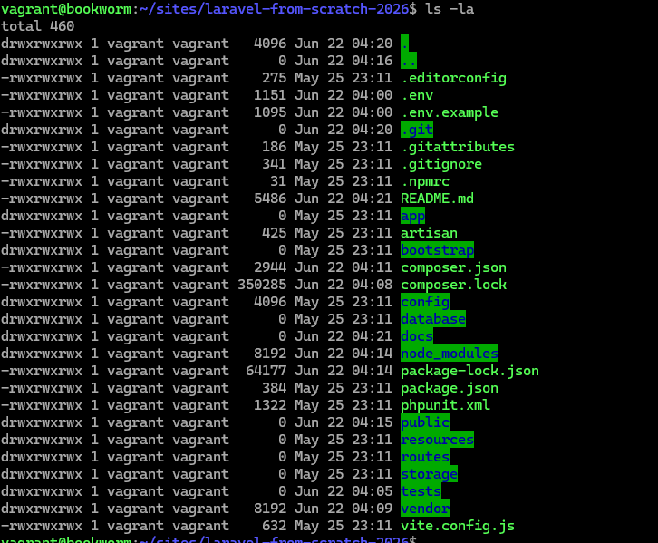

**2. Página inicial servida por Apache (`lfts.local`)**

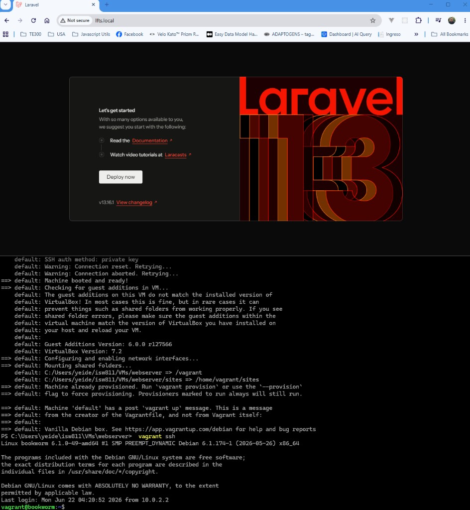

**3. Personalización de la vista welcome (código + navegador)**

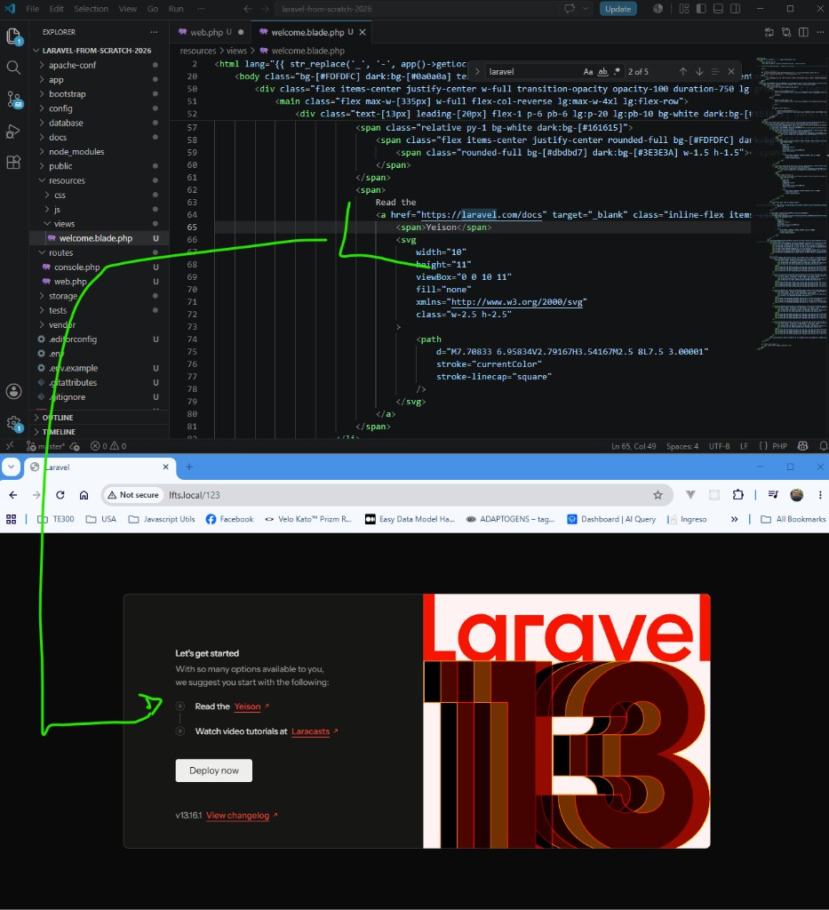

**Resultados obtenidos:**

- Proyecto creado en `vagrant@bookworm:~/sites/laravel-from-scratch-2026` con estructura Laravel completa.
- Virtual host `lfts.local` operativo desde la máquina anfitriona (`192.168.33.10`).
- Página de bienvenida de Laravel visible en el navegador.
- Edición en `welcome.blade.php` y ruta `/123` funcionando; cambios visibles al recargar `http://lfts.local/123`.

### Problemas y soluciones

No se presentaron errores al habilitar el virtual host. El sitio `larasite.local` sigue disponible en la misma VM sin conflicto, ya que Apache enruta por nombre de dominio (`ServerName`).

### Comentarios personales

La carpeta compartida de Vagrant permite editar el código en VS Code desde Windows (`C:\Users\yeide\isw811\VMs\webserver\sites\laravel-from-scratch-2026`) y ver los cambios de inmediato en `http://lfts.local`, sin copiar archivos ni usar `php artisan serve`. La prueba con el texto "Yeison" ayudó a confirmar que el ciclo edición → sincronización → Apache → navegador funciona correctamente.

### Commit Git

```
episodio-01: proyecto Laravel funcional con virtual host lfts.local
```

---

## Episodio 02: Set Up Your Development Environment {#episodio-02}

### Resumen

Este episodio del curso Laracasts cubre la instalación del entorno con Laravel Herd y la creación del proyecto. En el ambiente ISW811, ese contenido se completó durante el **Episodio 01** (proyecto en Vagrant, virtual host `lfts.local` y primera modificación de `welcome.blade.php`).

No se documenta por separado; ver sección **Episodio 01**.

### Commit Git

```
episodio-02: cubierto en episodio-01 (entorno y proyecto en Vagrant)
```

---

## Episodio 03: Routing 101 {#episodio-03}

### Resumen

En este episodio se analizó cómo Laravel registra rutas HTTP y las asocia a vistas Blade. Una ruta como la de la página de inicio define **tres piezas clave**:

1. **URI** — la URL que el usuario visita (por ejemplo `/`).
2. **Método HTTP** — `GET`, registrado con `Route::get()`.
3. **Callback** — la función que se ejecuta cuando la ruta coincide; en este caso devuelve una vista con `return view('welcome')`.

La función `view('welcome')` busca el archivo **`resources/views/welcome.blade.php`**, que contiene el HTML de la página. Laravel compila el archivo `.blade.php` y lo envía como respuesta al navegador.

Con ese mismo patrón se agregaron las rutas **`/about`** y **`/contact`**, cada una con su vista en `resources/views/`.

### Concepto: flujo ruta → vista

```
Petición GET /about
    → routes/web.php (Route::get('/about', ...))
    → callback: return view('about')
    → resources/views/about.blade.php
    → HTML renderizado en el navegador
```

### Comandos utilizados

```bash
cd ~/sites/laravel-from-scratch-2026
php artisan route:list
```

### Archivos modificados o creados

**`routes/web.php`**

```php
<?php

use Illuminate\Support\Facades\Route;

Route::get('/', function () {
    return view('welcome');
});

Route::get('/about', function () {
    return view('about');
});

Route::get('/contact', function () {
    return view('contact');
});
```

| Archivo | Descripción |
|---------|-------------|
| `routes/web.php` | Define las rutas GET `/`, `/about` y `/contact` |
| `resources/views/welcome.blade.php` | Vista de la página de inicio |
| `resources/views/about.blade.php` | Vista "ABOUT US" con enlace de regreso a inicio |
| `resources/views/contact.blade.php` | Vista "Contact Us" con información y formulario |

### Evidencia

**Página About (`http://lfts.local/about`)**


La captura muestra el código en `about.blade.php` (título **ABOUT US** y enlace `Return Home`) y el mismo contenido renderizado en el navegador, confirmando que la ruta carga la vista correcta.

**Página Contact (`http://lfts.local/contact`)**

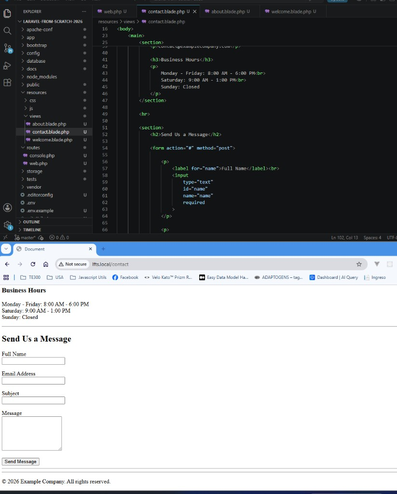

La vista `contact.blade.php` incluye secciones de información de contacto, horario de atención y un formulario "Send Us a Message", visible correctamente en `lfts.local/contact`.

**Evidencia obligatoria del entregable — rutas creadas**

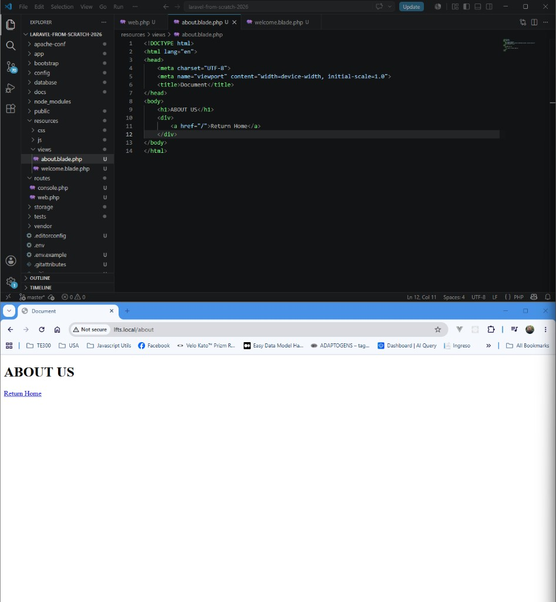

### Problemas y soluciones

No se presentaron errores. Las tres rutas responden correctamente desde Apache en `lfts.local`.

### Comentarios personales

`Route::get()` recibe la URI y un callback (closure). Cuando llega una petición GET que coincide, Laravel ejecuta el callback y devuelve lo que este retorne — normalmente una vista con `view('nombre')`. El nombre de la vista se mapea al archivo `resources/views/nombre.blade.php` sin escribir la ruta completa. Este patrón es la base de casi todas las páginas del curso antes de introducir controladores.

### Commit Git

```
episodio-03: rutas GET para welcome, about y contact
```

---

## Episodio 04: Layout Files {#episodio-04}

### Resumen

En este episodio se aprendió a extraer markup repetido en **componentes Blade reutilizables** dentro de `resources/views/components/`. Los archivos en esa carpeta se invocan con la sintaxis `<x-nombre>` (por ejemplo `<x-layout>`, `<x-card>`).

**Conceptos clave:**

| Concepto | Uso |
|----------|-----|
| **`{{ $slot }}`** | Contenido único que cada vista pasa al componente |
| **`@props`** | Datos dinámicos declarados en el componente, con valores por defecto |
| **Props vs atributos** | Lo definido explícitamente en `@props` (ej. `title`) es una prop; lo demás son atributos HTML |
| **`$attributes->merge()`** | Combina clases/atributos del componente con los que pasa la vista (override local) |

**Parte 1:** Se creó `layout.blade.php` con navegación compartida y `{{ $slot }}` para el contenido de cada página.

**Parte 2:** Se añadió la prop `title` con valor por defecto `'Laracast'`, estilos `.card` y `.max-w-400` en el layout, el componente `card.blade.php` con `$attributes->merge(['class' => 'card'])`, y se aplicó `<x-layout>` en `welcome`, `about` y `contact`.

### Comandos utilizados

```bash
# Sin comandos artisan — componentes y vistas Blade
```

### Archivos modificados o creados

**`resources/views/components/layout.blade.php`**

```blade
@props(['title' => 'Laracast'])

<title>{{ $title }}</title>
{{-- nav + estilos .card, .max-w-400 --}}
<main>{{ $slot }}</main>
```

**`resources/views/components/card.blade.php`**

```blade
<div {{ $attributes->merge(['class' => 'card']) }}>
    {{ $slot }}
</div>
```

**Vistas que consumen los componentes:**

```blade
{{-- welcome.blade.php --}}
<x-layout title="Home Page">
    <h1>ISW811 Welcome to Laravel 2026</h1>
</x-layout>

{{-- about.blade.php --}}
<x-layout title="About">
    <h1>ABOUT US</h1>
</x-layout>

{{-- contact.blade.php --}}
<x-layout title="Contact">
    <h1>Contact Us</h1>
    <x-card class="max-w-400">
        <p>Placeholder for the contact page</p>
    </x-card>
</x-layout>
```

| Archivo | Rol |
|---------|-----|
| `components/layout.blade.php` | Layout base: `title`, nav, `$slot`, estilos |
| `components/card.blade.php` | Tarjeta reutilizable con merge de clases |
| `welcome.blade.php` | `<x-layout title="Home Page">` |
| `about.blade.php` | `<x-layout title="About">` |
| `contact.blade.php` | `<x-layout title="Contact">` + `<x-card class="max-w-400">` |

### Cómo funciona `$attributes->merge()`

En `contact.blade.php` se pasa `class="max-w-400"` al componente card. El merge combina la clase base `card` del componente con `max-w-400` de la vista, produciendo en el HTML:

```html
<div class="card max-w-400">...</div>
```

Así el componente define estilos por defecto y cada vista puede añadir o sobrescribir clases sin duplicar el markup del card.

### Evidencia

**Parte 1 — layout y `$slot`**

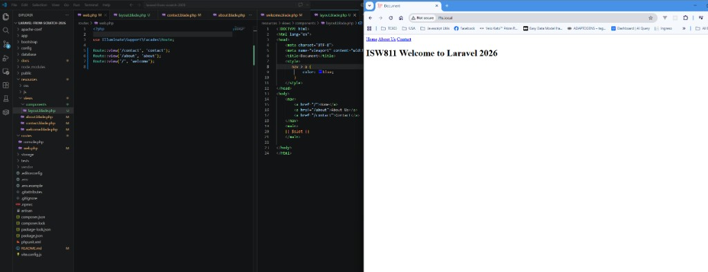

**Parte 2 — props, card y `$attributes->merge()`**

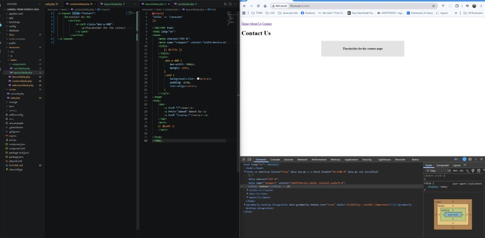

La captura muestra `contact.blade.php` con `<x-layout title="Contact">` y `<x-card class="max-w-400">`, el código de `layout.blade.php` y `card.blade.php`, y en el navegador/DevTools el `div` renderizado como `class="card max-w-400"` con título de pestaña **Contact**.

### Problemas y soluciones

No se presentaron errores. El merge de clases se verificó en las herramientas de desarrollo del navegador.

### Comentarios personales

Los componentes en `resources/views/components/` son la forma idiomática de Laravel para layouts y piezas UI reutilizables. Las **props** (`title`) permiten datos dinámicos con defaults; el **slot** permite contenido distinto por página; **`$attributes->merge()`** evita perder clases al pasar atributos desde fuera del componente.

### Commit Git

```
episodio-04: layouts y componentes Blade con props, slot y merge de clases
```

---

## Episodio 05: Pass Data to Views {#episodio-05}

### Resumen

En este episodio se aprendió a **pasar datos desde la ruta hacia una vista Blade**. El tercer argumento de `Route::view()` acepta un arreglo asociativo cuyas claves se convierten en variables disponibles en la vista (`$greeting`, `$person`).

También se tomó un valor desde el **query string** de la URL con `request('person', 'World')`, donde el segundo parámetro es el **valor por defecto** si `person` no está presente en la petición.

**Escape en Blade:**

| Sintaxis | Comportamiento |
|----------|----------------|
| `{{ $person }}` | Escapa HTML automáticamente (equivalente seguro a `echo` con protección XSS) |
| `{!! $person !!}` | Renderiza sin escapar — solo cuando se confía totalmente en el dato |

En la implementación final se usó `{{ }}` para mostrar el saludo de forma segura.

### Comandos utilizados

```bash
# Probar en el navegador con query string:
# http://lfts.local/?person=Yeison
# http://lfts.local/          → person por defecto: World
```

### Archivos modificados o creados

**`routes/web.php`**

```php
Route::view('/', 'welcome', [
    'greeting' => 'Hello',
    'person' => request('person', 'World'),
]);
```

**`resources/views/welcome.blade.php`**

```blade
<x-layout title="Home Page">
    <h1>ISW811 Welcome to Laravel 2026</h1>
    {{ $greeting }}, {{ $person }}
</x-layout>
```

| Variable | Origen | Ejemplo |
|----------|--------|---------|
| `$greeting` | Valor fijo en la ruta | `Hello` |
| `$person` | Query string `?person=` o default | `Yeison` o `World` |

### Evidencia

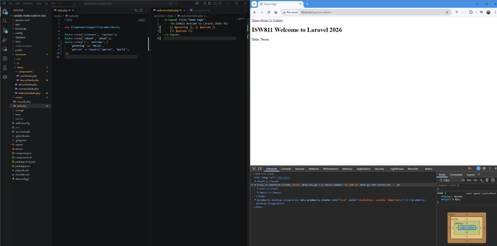

**Resultado obtenido:** con la URL `http://lfts.local/?person=Yeison`, la página muestra **"Hello, Yeison"**. Sin query string, `request('person', 'World')` devuelve **World** por defecto.

### Problemas y soluciones

No se presentaron errores.

### Comentarios personales

Blade escapa por defecto con `{{ }}`, lo que reduce el riesgo de inyección XSS frente a un `echo` directo en PHP. `{!! !!}` existe para HTML confiable (por ejemplo contenido generado por el propio sistema), pero no debe usarse con datos que vienen del usuario sin sanitizar.

### Commit Git

```
episodio-05: paso de datos y query string a vistas Blade
```

---

## Episodio 06: Blade Directives {#episodio-06}

### Resumen

En este episodio se exploraron las **directivas Blade** para depuración y control de flujo. Se pasó un arreglo `$tasks` desde la ruta hacia `welcome.blade.php` y se practicó con varias directivas para inspeccionar y renderizar ese arreglo según tenga o no elementos.

**Directivas utilizadas:**

| Directiva | Propósito |
|-----------|-----------|
| `@dump($tasks)` | Depurar variables en pantalla (formato legible) |
| `@if (count($tasks))` … `@endif` | Ejecutar markup solo si hay tareas |
| `@foreach ($tasks as $task)` … `@endforeach` | Iterar cada elemento del arreglo |
| `@unless (count($tasks))` … `@endunless` | Inverso de `@if` — solo si el arreglo está vacío |
| `@forelse ($tasks as $task)` … `@empty` … `@endforelse` | Bucle + mensaje alternativo si está vacío |

Se cambió la ruta `/` de `Route::view()` a `Route::get()` con closure para pasar el arreglo `tasks` junto con `greeting` y `person`.

### Comandos utilizados

```bash
# Ver resultado en el navegador:
# http://lfts.local/
```

### Archivos modificados o creados

**`routes/web.php`**

```php
Route::get('/', function () {
    return view('welcome', [
        'tasks' => ['task 1', 'task 2', 'task 3'],
        'greeting' => 'Hello World',
        'person' => 'Yeison',
    ]);
});
```

**`resources/views/welcome.blade.php`** (fragmento principal):

```blade
@dump($tasks)

@if (count($tasks))
    <p>Yes we have tasks. How Many? <?= count($tasks) ?> tasks, in fact</p>
@endif

@foreach ($tasks as $task)
    <li>{{ $task }}</li>
@endforeach

@unless (count($tasks))
    <p> there are no active tasks </p>
@endunless

@forelse ($tasks as $task)
    <li>{{ $task }}</li>
@empty
    <p> there are no active tasks </p>
@endforelse
```

### Evidencia

**1. `@dump($tasks)` — inspección del arreglo**

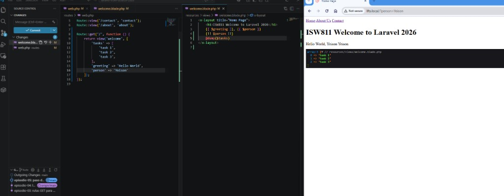

**2. Arreglo vacío — `@unless` muestra mensaje alternativo**

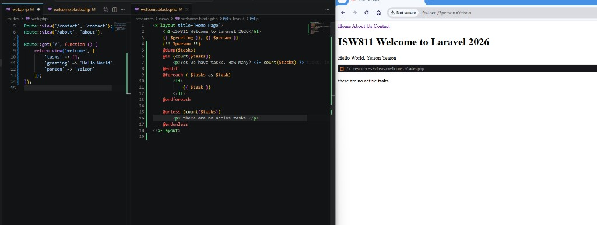

Con `'tasks' => []` en la ruta, `@if` y `@foreach` no renderizan contenido; `@unless` muestra *"there are no active tasks"*.

**3. Arreglo con tareas — `@if`, `@foreach` y `@forelse`**

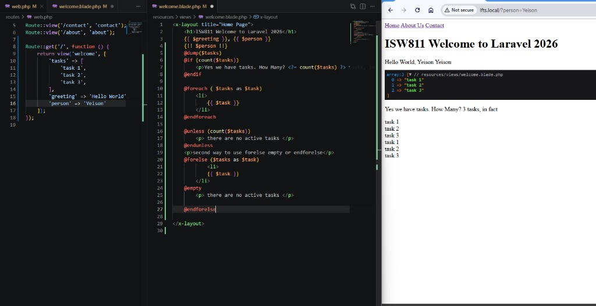

Con tres tareas, `@dump` muestra `array:3`, `@if` confirma *"Yes we have tasks. How Many? 3 tasks, in fact"*, y ambos bucles listan task 1, task 2 y task 3.

### Problemas y soluciones

No se presentaron errores. Se probó el mismo template con arreglo vacío y con elementos para ver el comportamiento de `@unless` y `@forelse @empty`.

### Comentarios personales

`@dump` es útil durante desarrollo para ver la estructura exacta de una variable. `@forelse` combina `@foreach` y el caso vacío en una sola directiva, evitando un `@if` extra. `@unless` es equivalente a `@if (!condición)` y hace el template más legible cuando la lógica es negativa.

### Commit Git

```
episodio-06: directivas Blade dump, if, foreach, unless y forelse
```

---

## Episodio 07: Forms {#episodio-07}

### Resumen

En este episodio se creó un **formulario POST** para capturar ideas, se aplicó **Tailwind CSS** al textarea y al botón, y se guardaron las ideas en la **sesión** de Laravel (almacenamiento temporal del servidor, no persistente en base de datos).

Flujo completo:

1. **GET `/`** — carga ideas desde sesión y muestra `ideas.blade.php`
2. **POST `/ideas`** — recibe el campo `idea`, lo agrega a la sesión y redirige
3. **GET `/delete-ideas`** — ruta temporal para vaciar la sesión con `session()->forget('ideas')`

### Tailwind CSS

Se integró Tailwind en `layout.blade.php` vía CDN:

```html
<script src="https://cdn.jsdelivr.net/npm/@tailwindcss/browser@4"></script>
```

El formulario usa clases utilitarias (`bg-white/5`, `rounded-md`, `bg-indigo-500`, etc.) para el textarea y el botón **Save**.

### Formulario POST y `@csrf`

**`resources/views/ideas.blade.php`**

```blade
<form method="POST" action="/ideas">
    @csrf
    <textarea name="idea" id="idea" rows="3" class="..."></textarea>
    <button type="submit" class="...">Save</button>
</form>
```

| Atributo | Función |
|----------|---------|
| `method="POST"` | Envía datos al servidor (no visibles en la URL) |
| `action="/ideas"` | URI del endpoint que procesa el formulario |
| `@csrf` | Genera un token oculto `_token` en el formulario |

**¿Cómo funciona `@csrf`?** Laravel incluye un token único por sesión. Al enviar el POST, el framework verifica que el token coincida. Si falta o es inválido, rechaza la petición. Esto mitiga **CSRF** (Cross-Site Request Forgery): un sitio externo no puede enviar formularios en nombre del usuario sin conocer ese token.

### Session storage — guardar, cargar y eliminar

**Guardar idea (POST `/ideas`):**

```php
Route::post('/ideas', function () {
    $idea = request('idea');
    session()->push('ideas', $idea);
    return redirect('/');
});
```

**Cargar ideas (GET `/`):**

```php
Route::get('/', function () {
    $ideas = session()->get('ideas', []);
    return view('ideas', ['ideas' => $ideas]);
});
```

**Eliminar sesión (temporal — GET `/delete-ideas`):**

```php
Route::get('/delete-ideas', function () {
    session()->forget('ideas');
    return redirect('/');
});
```

**Mostrar en la vista:**

```blade
@if (count($ideas))
    <h2>Your Ideas</h2>
    @foreach ($ideas as $idea)
        <li>{{ $idea }}</li>
    @endforeach
@endif
```

> **Nota:** Los datos en sesión se pierden al expirar la sesión o al llamar `forget()`. En el Episodio 08 se migrará a base de datos con Eloquent.

### Comandos utilizados

```bash
npm run dev   # si se usa Vite además del CDN de Tailwind
```

### Archivos modificados o creados

| Archivo | Cambio |
|---------|--------|
| `resources/views/ideas.blade.php` | Formulario POST, `@csrf`, listado de ideas |
| `resources/views/components/layout.blade.php` | Tailwind CDN, fondo `bg-gray-700` |
| `routes/web.php` | GET `/`, POST `/ideas`, GET `/delete-ideas` |

### Evidencia

**1. Formulario POST + `@csrf` — primera prueba con `dd("Hello!")`**

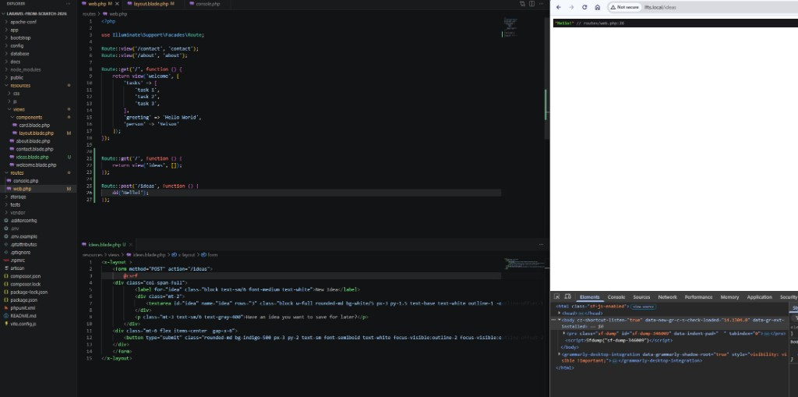

**2. Idea guardada en sesión y listada ("test laravel")**

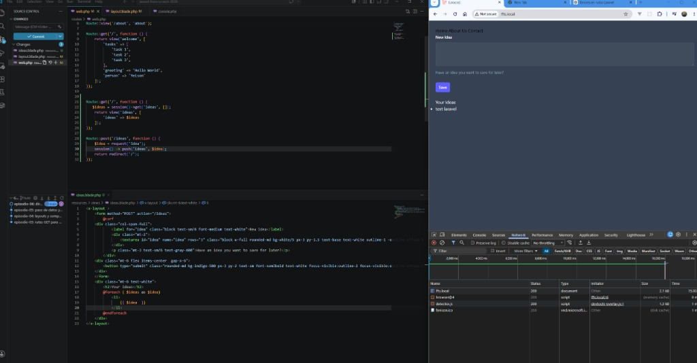

**3. Eliminación de ideas con `/delete-ideas`**

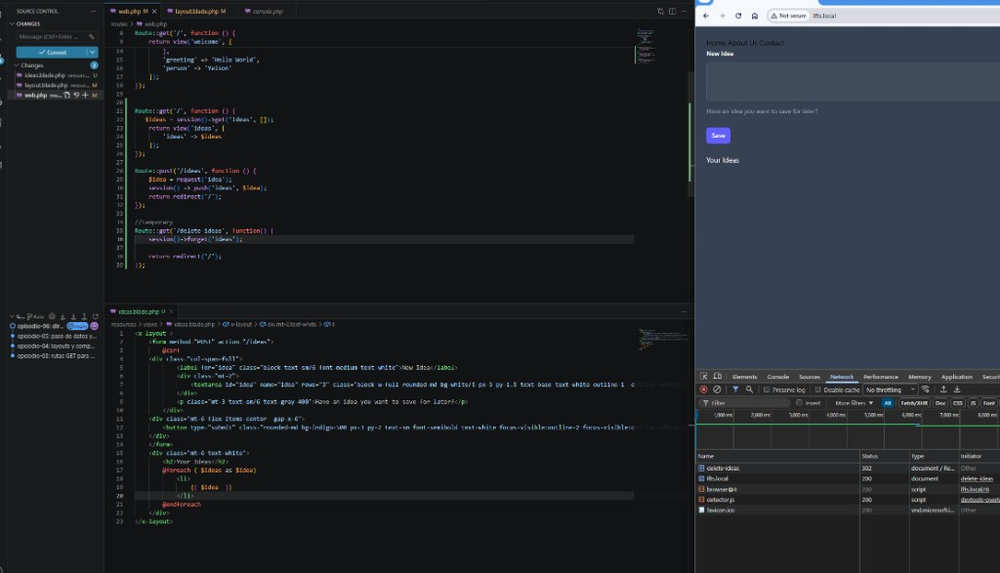

**Evidencia obligatoria — formulario funcional**


### Problemas y soluciones

No se presentaron errores. La primera prueba usó `dd("Hello!")` en la ruta POST para confirmar que el formulario llegaba al endpoint; luego se reemplazó por la lógica de sesión.

### Comentarios personales

La sesión es útil para prototipos rápidos, pero no sustituye una base de datos: al cerrar el navegador o limpiar la sesión, las ideas desaparecen. El patrón **POST → redirect → GET** (PRG) evita reenvíos accidentales del formulario al refrescar la página.

### Commit Git

```
episodio-07: formulario POST, CSRF y ideas en session storage
```

---

## Episodio 08: Databases, Migrations, and Eloquent {#episodio-08}

### Resumen

Se migró el almacenamiento de ideas desde **session storage** (Ep. 07) hacia **MariaDB** con migraciones, Query Builder y **Eloquent**. Se creó la tabla `ideas`, se agregó la columna `state`, el modelo `Idea`, inserción con `Idea::create()` y filtrado opcional por query string (`?state=active`).

| Antes (sesión) | Ahora (BD + Eloquent) |
|----------------|----------------------|
| `$ideas` arreglo PHP | `$ideas` Collection |
| `count($ideas)` | `$ideas->count()` |
| `{{ $idea }}` | `{{ $idea->description }}` |

### Conceptos clave

| Concepto | Descripción |
|----------|-------------|
| **Migración** | Archivo PHP que define cambios de schema (`up` / `down`) |
| **Query Builder** | `DB::table('ideas')->get()` — acceso a BD sin modelo |
| **Eloquent** | Clase `Idea` = tabla `ideas`; interfaz orientada a objetos |
| **Mass assignment** | `$guarded` / `$fillable` controlan qué campos acepta `create()` |
| **`->when()`** | Aplica un filtro solo si hay query string en la URL |

### Implementación

#### 1. Migración `create_ideas_table`

```bash
php artisan make:migration
# nombre: create_ideas_table
```

`database/migrations/2026_06_22_220326_create_ideas_table.php`:

```php
Schema::create('ideas', function (Blueprint $table) {
    $table->id();
    $table->timestamps();
    $table->text('description');
});
```

```bash
php artisan migrate
```

#### 2. Query Builder y vista

**`routes/web.php`** (paso intermedio):

```php
$ideas = DB::table('ideas')->get();
```

**`resources/views/ideas.blade.php`:**

```blade
@if ($ideas->count())
    @foreach ($ideas as $idea)
        <li>{{ $idea->description }}</li>
    @endforeach
@endif
```

#### 3. Cambios de schema — tres opciones

| Opción | Acción | ¿Pierde datos? | Cuándo |
|--------|--------|----------------|--------|
| **1** | Editar migración existente | Depende | Solo desarrollo local |
| **2** | `php artisan migrate:refresh` | **Sí — todos** | Resetear BD en desarrollo |
| **3** | Nueva migración por cambio | **No** | **Producción y equipos** |

**Opción 2 — `migrate:refresh`**

Revierte todas las migraciones y las re-ejecuta. La tabla queda vacía tras el refresh.

**Opción 3 — `add_state_to_ideas_table` (recomendada)**

```bash
php artisan make:migration
# nombre: add_state_to_ideas_table
```

```php
// up
Schema::table('ideas', function (Blueprint $table) {
    $table->string('state');
});

// down
Schema::table('ideas', function (Blueprint $table) {
    $table->dropColumn('state');
});
```

| Método | Uso |
|--------|-----|
| `Schema::create()` | Crear tabla nueva |
| `Schema::table()` | Modificar tabla existente |

#### 4. Modelo Eloquent `Idea`

```bash
php artisan make:model Idea
```

Convención: modelo **singular** (`Idea`) → tabla **plural** (`ideas`).

**`app/Models/Idea.php`:**

```php
class Idea extends Model
{
    protected $guarded = [];
}
```

`$guarded = []` deja la lista negra vacía: **ningún** campo bloqueado para `create()`. En producción se prefiere `$fillable = ['description', 'state']`.

#### 5. Crear y listar con Eloquent

**POST `/ideas`:**

```php
Idea::create([
    'description' => request('idea'),
    'state' => 'pending',
]);
```

**GET `/`:**

```php
$ideas = Idea::query()
    ->when(request('state'), function ($query, $state) {
        $query->where('state', $state);
    })
    ->get();
```

| URL | Resultado |
|-----|-----------|
| `lfts.local/` | Todas las ideas |
| `lfts.local/?state=pending` | Solo `pending` |
| `lfts.local/?state=active` | Solo `active` |

Se depuró primero con `dd($state)` dentro del callback de `->when()`; luego se aplicó `where('state', $state)`.

### Comandos utilizados

```bash
php artisan make:migration          # create_ideas_table
php artisan migrate
php artisan migrate:refresh         # opción 2
php artisan make:migration          # add_state_to_ideas_table
php artisan migrate
php artisan make:model Idea
```

### Archivos modificados o creados

| Archivo | Cambio |
|---------|--------|
| `database/migrations/2026_06_22_220326_create_ideas_table.php` | Tabla `ideas` + `description` |
| `database/migrations/2026_06_22_223513_add_state_to_ideas_table.php` | Columna `state` |
| `app/Models/Idea.php` | Modelo Eloquent |
| `routes/web.php` | Eloquent + filtro `when()` |
| `resources/views/ideas.blade.php` | Listado `$idea->description` |

### Evidencia

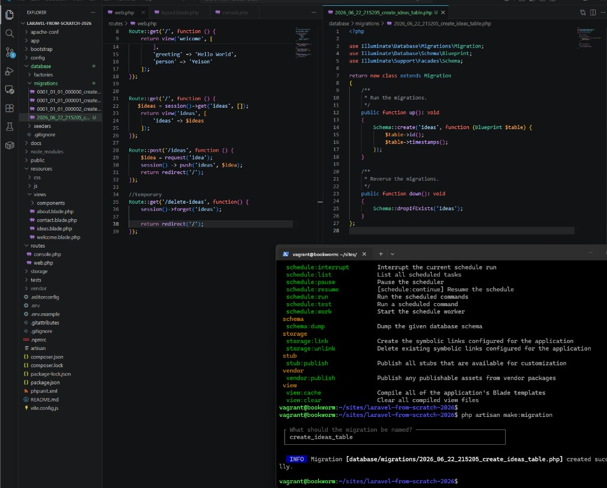

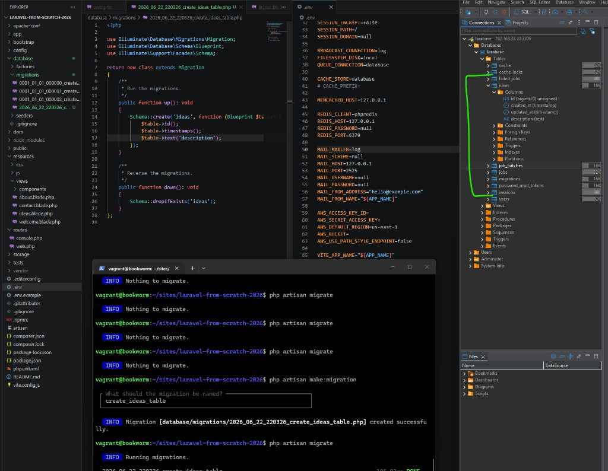

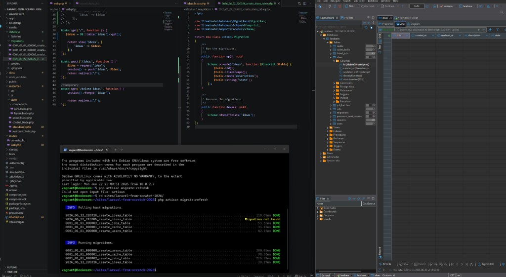

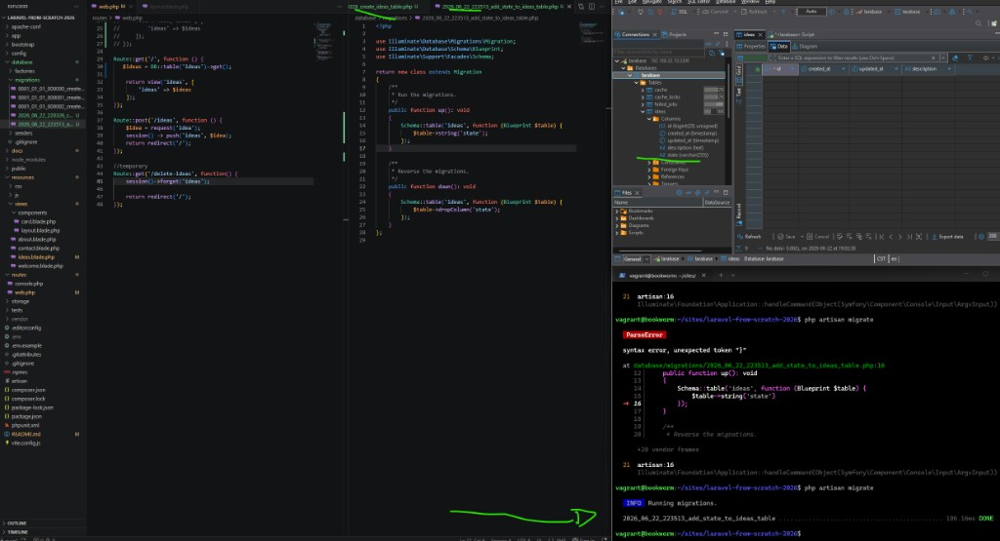

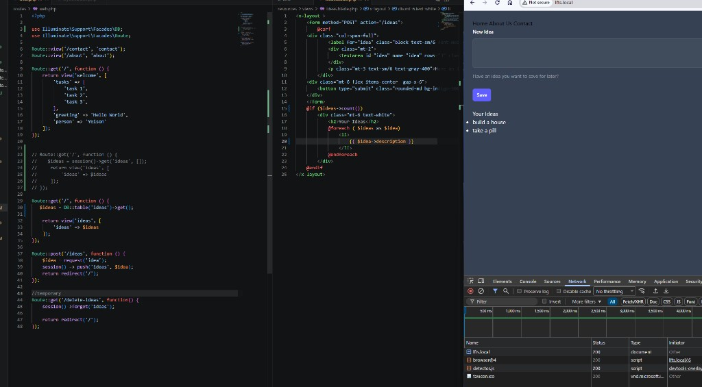

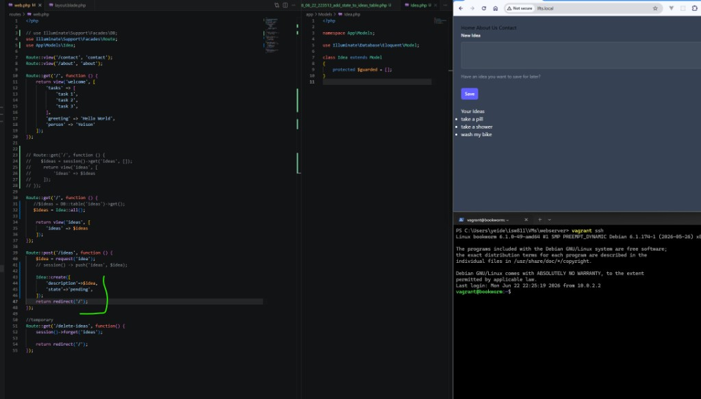

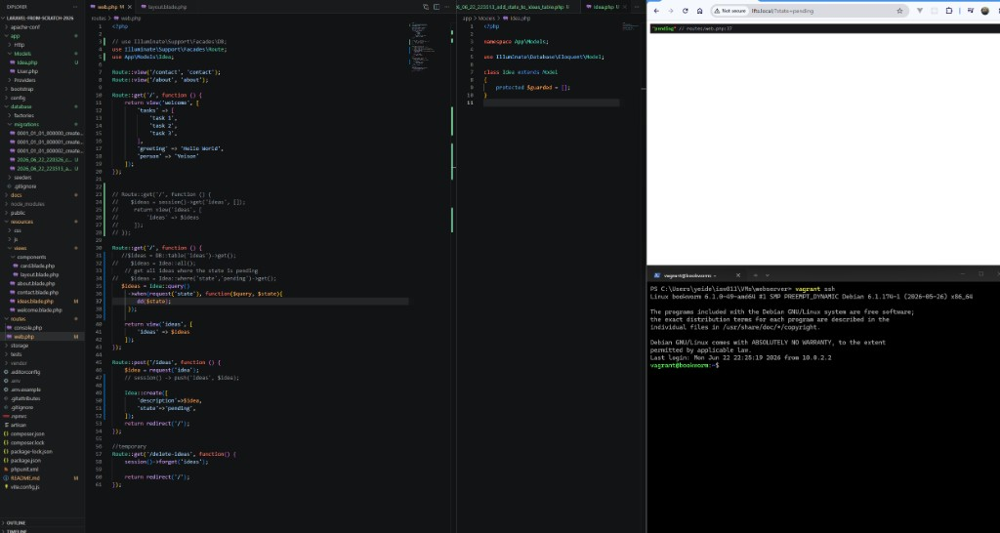

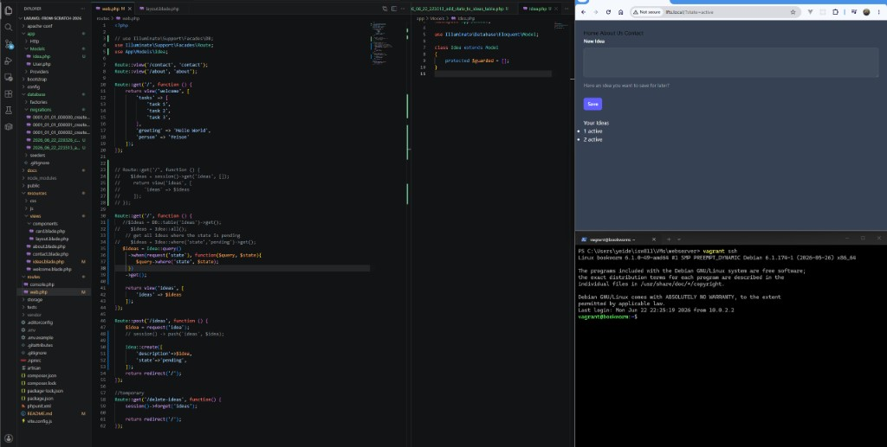

**Evidencia obligatoria — listado desde BD:**


### Problemas y soluciones

- **`Nothing to migrate.`** — Migración ya ejecutada; verificar tabla `migrations`.
- **`ParseError: unexpected token "}"`** — Llave extra en `add_state_to_ideas_table.php`; corregir y volver a `migrate`.
- **`Migration not found` en refresh** — Registro huérfano de migración eliminada; no bloquea el comando.
- **Tabla vacía tras refresh** — Esperado en opción 2; opción 3 conserva datos.

### Comentarios personales

Una migración por cambio de schema mantiene historial claro y evita perder datos. Eloquent simplifica el código respecto a Query Builder: cada fila es un objeto `Idea`. El patrón `->when(request('state'), ...)` evita duplicar rutas o consultas para filtros opcionales.

### Commit Git

```
episodio-08: migraciones, modelo Idea, Eloquent y filtro por state
```

---

## Episodio 09: HTTP Requests and REST {#episodio-09}

### Resumen

*[Pendiente: CRUD completo, route model binding, method spoofing @method.]*

### Comandos utilizados

```bash
php artisan route:list
```

### Archivos modificados o creados

- `routes/web.php`
- `resources/views/ideas/*.blade.php`

### Evidencia


### Problemas y soluciones

*[Pendiente]*

### Comentarios personales

*[Pendiente]*

### Commit Git

```
episodio-09: CRUD RESTful para ideas
```

---

## Episodio 10: Controllers {#episodio-10}

### Resumen

*[Pendiente: IdeaController con acciones resourceful, vista create separada.]*

### Comandos utilizados

```bash
php artisan make:controller IdeaController --resource
```

### Archivos modificados o creados

- `app/Http/Controllers/IdeaController.php`
- `routes/web.php`
- `resources/views/ideas/create.blade.php`
- `resources/views/ideas/index.blade.php`

### Evidencia


### Problemas y soluciones

*[Pendiente]*

### Comentarios personales

*[Pendiente]*

### Commit Git

```
episodio-10: IdeaController y rutas resourceful
```

---

## Episodio 11: Request Validation {#episodio-11}

### Resumen

*[Pendiente: request->validate(), @error, componente x-error.]*

### Comandos utilizados

```bash
# N/A
```

### Archivos modificados o creados

- `app/Http/Controllers/IdeaController.php`
- `resources/views/components/error.blade.php`
- `resources/views/ideas/create.blade.php`

### Evidencia


### Problemas y soluciones

*[Pendiente]*

### Comentarios personales

*[Pendiente]*

### Commit Git

```
episodio-11: validación de requests y mensajes de error
```

---

## Episodio 12: Form Request Classes {#episodio-12}

### Resumen

*[Pendiente: StoreIdeaRequest, authorize(), rules(), type-hint en controlador.]*

### Comandos utilizados

```bash
php artisan make:request StoreIdeaRequest
```

### Archivos modificados o creados

- `app/Http/Requests/StoreIdeaRequest.php`
- `app/Http/Controllers/IdeaController.php`

### Evidencia


### Problemas y soluciones

*[Pendiente]*

### Comentarios personales

*[Pendiente]*

### Commit Git

```
episodio-12: clases Form Request para validación
```

---

## Episodio 13: A Brief DaisyUI Detour {#episodio-13}

### Resumen

*[Pendiente: Tailwind + DaisyUI, componentes nav e idea-card, mejora visual.]*

### Comandos utilizados

```bash
npm install
npm run dev
```

### Archivos modificados o creados

- `resources/views/components/nav.blade.php`
- `resources/views/components/idea-card.blade.php`
- `resources/views/ideas/index.blade.php`
- `resources/css/app.css`

### Evidencia


### Problemas y soluciones

*[Pendiente]*

### Comentarios personales

*[Pendiente]*

### Commit Git

```
episodio-13: estilos con Tailwind y DaisyUI
```

---

## Episodio 14: Authentication Explained {#episodio-14}

### Resumen

*[Pendiente: registro, login, controladores de sesión, Hash, @auth/@guest, logout.]*

### Comandos utilizados

```bash
php artisan make:controller RegisteredUserController
php artisan make:controller SessionsController
php artisan migrate
```

### Archivos modificados o creados

- `app/Http/Controllers/RegisteredUserController.php`
- `app/Http/Controllers/SessionsController.php`
- `routes/web.php`
- `resources/views/auth/*.blade.php`
- `resources/views/components/nav.blade.php`

### Evidencia


### Problemas y soluciones

*[Pendiente]*

### Comentarios personales

*[Pendiente]*

### Commit Git

```
episodio-14: registro, login y logout de usuarios
```

---

## Episodio 15: Require Authentication With Middleware {#episodio-15}

### Resumen

*[Pendiente: middleware auth/guest, user_id en ideas, Auth::id(), filtrar ideas por usuario.]*

### Comandos utilizados

```bash
php artisan make:migration add_user_id_to_ideas_table
php artisan migrate
```

### Archivos modificados o creados

- `database/migrations/xxxx_add_user_id_to_ideas_table.php`
- `routes/web.php`
- `app/Http/Controllers/IdeaController.php`

### Evidencia


### Problemas y soluciones

*[Pendiente]*

### Comentarios personales

*[Pendiente]*

### Commit Git

```
episodio-15: middleware de autenticación y user_id en ideas
```

---

## Episodio 16: Eloquent Relationships {#episodio-16}

### Resumen

*[Pendiente: belongsTo/hasMany, auth()->user()->ideas()->create().]*

### Comandos utilizados

```bash
# N/A
```

### Archivos modificados o creados

- `app/Models/Idea.php`
- `app/Models/User.php`
- `app/Http/Controllers/IdeaController.php`

### Evidencia


### Problemas y soluciones

*[Pendiente]*

### Comentarios personales

*[Pendiente]*

### Commit Git

```
episodio-16: relaciones User-Idea con Eloquent
```

---

## Checklist de cierre — Entregable 01

- [ ] Episodios 01–16 completados y documentados
- [ ] Mínimo 16 commits (uno por episodio) en el historial Git
- [ ] Las 12 capturas obligatorias guardadas en `docs/img/`
- [ ] CRUD completo de ideas funcionando en navegador
- [ ] Auth (registro, login, logout) funcionando
- [ ] Relación User–Idea verificada
- [ ] Proyecto ejecutable tras `composer install`, `npm install`, `php artisan migrate`
- [ ] `README.md` con instrucciones de instalación
- [ ] Archivo `ISW811_Proyecto1_Entregable01_HernandezGaritaYeison.tar.gz` generado sin `vendor/` ni `node_modules/`
- [ ] Subido al Campus Virtual UTN antes del **22/06/2026 23:59**
