# Entregable 02 — Laravel From Scratch 2026

| Campo | Valor |
|-------|-------|
| **Estudiante** | Yeison Roberto Hernandez Garita |
| **Curso** | ISW811 |
| **Entregable** | 02 — Autorización, Vite, notificaciones, colas, pruebas y primera parte del proyecto final |
| **Fecha límite** | 29 de junio de 2026 |
| **Episodios cubiertos** | 17 al 30 *(aprox.)* |

---

## Resumen del entregable

### Dos carpetas, una documentación

| Desde Ep. | Código Laravel | Documentación + capturas |
|-----------|----------------|--------------------------|
| 1–22 | `~/sites/laravel-from-scratch-2026-old` *(archivo)* | `~/sites/laravel-from-scratch-2026/docs/` |
| 23–30 | `~/sites/laravel-from-scratch-2026` *(proyecto Idea nuevo)* | **Misma carpeta** `docs/` |

Ver [estructura-proyectos.md](./estructura-proyectos.md) para rutas, Apache, Git y empaquetado del `.tar.gz`.

---

## Índice de episodios

| # | Episodio | Estado | Enlace |
|---|----------|--------|--------|
| 17 | Authorization Using Gates | Completado | [Episodio 17](#episodio-17) |
| 18 | Authorization Using Policies | Completado | [Episodio 18](#episodio-18) |
| 19 | Frontend Asset Bundling with Vite | Completado | [Episodio 19](#episodio-19) |
| 20 | Notifications | Completado | [Episodio 20](#episodio-20) |
| 21 | When to Queue it Up | Completado | [Episodio 21](#episodio-21) |
| 22 | How to Get Started Testing Your Code | Inconcluso | [Episodio 22](#episodio-22) |
| 23 | Final Project Setup | Completado | [Episodio 23](#episodio-23) |
| 24 | Design Your Model Layer | Completado | [Episodio 24](#episodio-24) |
| 25 | Tailwind Theme Setup And Initial UI | Completado | [Episodio 25](#episodio-25) |
| 26 | Browser Testing Registration Forms With Pest | Inconcluso | [Episodio 26](#episodio-26) |
| 27 | Flash Messaging and Interactivity with AlpineJS | Pendiente | — |
| 28 | Idea Cards | Pendiente | — |
| 29 | Idea Filtering | Pendiente | — |
| 30 | Show A Single Idea | Pendiente | — |

---

## Plantilla por episodio

> Copiar el bloque siguiente por cada episodio y completarlo al avanzar en el curso.

```markdown
## Episodio XX: Nombre del episodio

### Resumen
[Qué se aprendió y qué se implementó.]

### Comandos utilizados
```bash
# comandos relevantes
```

### Archivos modificados o creados
- ruta/archivo.php

### Evidencia


### Problemas y soluciones
[Si hubo errores, cómo se resolvieron.]

### Comentarios personales
[Apuntes técnicos.]

### Commit Git
episodio-XX: descripción breve del cambio
```

---

## Episodio 17: Authorization Using Gates {#episodio-17}

### Resumen

Se agregó **autorización con Gates** para controlar acceso tipo rol (p. ej. área admin). Un **Gate** es una regla de autorización definida en `AppServiceProvider` y reutilizable en rutas, controladores y Blade.

### Definir el Gate — `AppServiceProvider`

```php
use Illuminate\Support\Facades\Gate;
use Illuminate\Auth\Access\Response;
use App\Models\User;

public function boot(): void
{
    Gate::define('view-admin', function (User $user) {
        if ($user->id == 1) {
            return Response::allow();
        }

        return Response::denyAsNotFound();
    });
}
```

La lógica puede ser cualquier condición sobre `$user` (id, email, rol en BD, etc.).

### Usar el Gate en la UI — `@can`

**`nav.blade.php`**

```blade
@can('view-admin')
    <li><a href="/admin">Admin</a></li>
@endcan
```

Solo usuarios autorizados ven el enlace Admin.

### Proteger la ruta — tres formas

**1. Método `->can()` en la ruta**

```php
Route::get('/admin', function () {
    return 'private admin area';
})->can('view-admin');
```

**2. `Gate::authorize()` dentro del closure**

```php
use Illuminate\Support\Facades\Gate;

Route::get('/admin', function () {
    Gate::authorize('view-admin');
    return 'private admin area';
});
```

Si el usuario no pasa el gate → **403 Forbidden** (*This action is unauthorized*).

**3. Enmascarar 403 como 404**

En la definición del Gate, en lugar de denegar con 403:

```php
return Response::denyAsNotFound();
```

El usuario no autorizado ve **404 Not Found** en `/admin` — no revela que la ruta existe.

| Respuesta | Cuándo usarla |
|-----------|----------------|
| `Response::allow()` | Usuario autorizado |
| Denegación normal | 403 explícito |
| `Response::denyAsNotFound()` | Ocultar recurso (admin, APIs internas) |

### Archivos tocados

`AppServiceProvider.php`, `routes/web.php`, `nav.blade.php`

### Evidencia

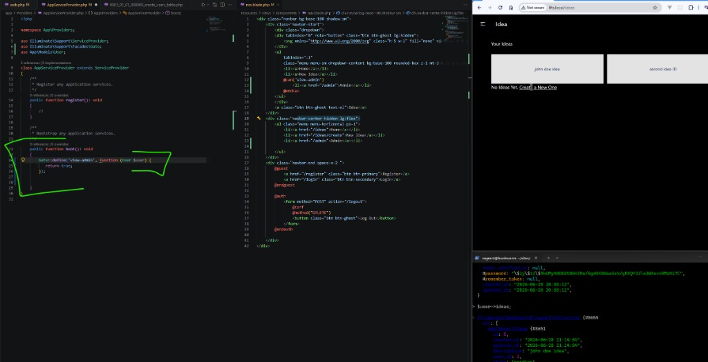

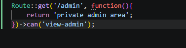

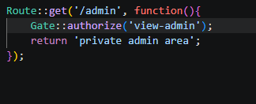

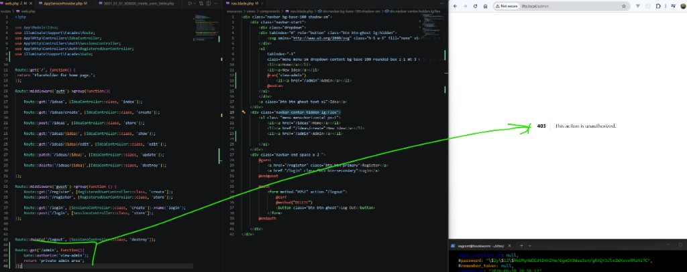

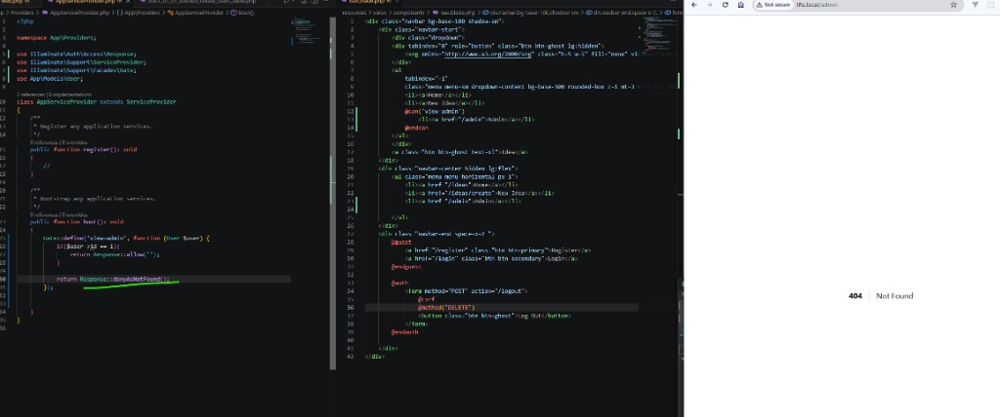

### Problemas y soluciones

Sin errores de implementación. Se probó acceso a `/admin` con usuario sin permiso: primero 403, luego 404 al usar `denyAsNotFound()`.

### Comentarios personales

Gates sirven para reglas globales simples; en el Ep. 18 se pasará a **Policies** para autorización por modelo (`Idea`).

### Commit Git

```
episodio-17: autorización con Gates y view-admin
```

---

## Episodio 18: Authorization Using Policies {#episodio-18}

### Resumen

Una **Policy** centraliza reglas de autorización **por modelo** (`Idea`). Laravel la genera con Artisan y la aplica en controladores con `Gate::authorize()`, `Auth::user()->can()` o `@can` en Blade. Se protegió **show** para que solo el dueño vea su idea y **create** para exigir admin.

### ¿Qué es una Policy?

| Concepto | Gate (Ep. 17) | Policy (Ep. 18) |
|----------|-----------------|-----------------|
| Alcance | Reglas globales (`view-admin`) | Reglas por modelo (`Idea`) |
| Ubicación | `AppServiceProvider` | `app/Policies/IdeaPolicy.php` |
| Métodos | Un closure por ability | `view`, `update`, `create`, `delete`, etc. |

Laravel mapea automáticamente `Idea` → `IdeaPolicy`.

### Crear la Policy

```bash
php artisan make:policy
# Name: IdeaPolicy
# Model: Idea
```

Genera `app/Policies/IdeaPolicy.php` con stubs: `viewAny`, `view`, `create`, `update`, `delete`…

### Reglas en `IdeaPolicy`

**Solo el dueño puede ver/editar su idea:**

```php
public function update(User $user, Idea $idea): bool
{
    return $user->is($idea->user);
    // equivalente: $user->id === $idea->user_id
}
```

**Solo admin puede crear ideas:**

```php
public function create(User $user): bool
{
    return $user->isAdmin();
}
```

(`isAdmin()` en el modelo `User` — p. ej. `$user->id === 1` o columna `role`.)

### Usar en el controlador

**Opción 1 — `Gate::authorize()`** (en `show`):

```php
public function show(Idea $idea)
{
    Gate::authorize('update', $idea);

    return view('ideas.show', ['idea' => $idea]);
}
```

Si el usuario no es dueño → **403 This action is unauthorized**.

**Opción 2 — `Auth::user()->can()`**

```php
if (Auth::user()->can('update', $idea)) {
    // permitido
}
```

Laravel resuelve la Policy según el tipo del segundo argumento (`$idea`).

### Resultados probados

| Escenario | Resultado |
|-----------|-----------|
| Usuario accede a idea ajena (`/ideas/4`) | 403 |
| No-admin visita `/ideas/create` | 404 (si se enmascara con gate/policy + `denyAsNotFound`) |

### Archivos tocados

`IdeaPolicy.php`, `IdeaController.php` (`show`), `User.php` (`isAdmin()` si aplica)

### Evidencia

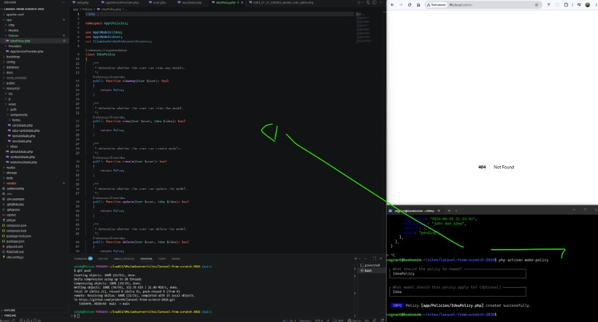

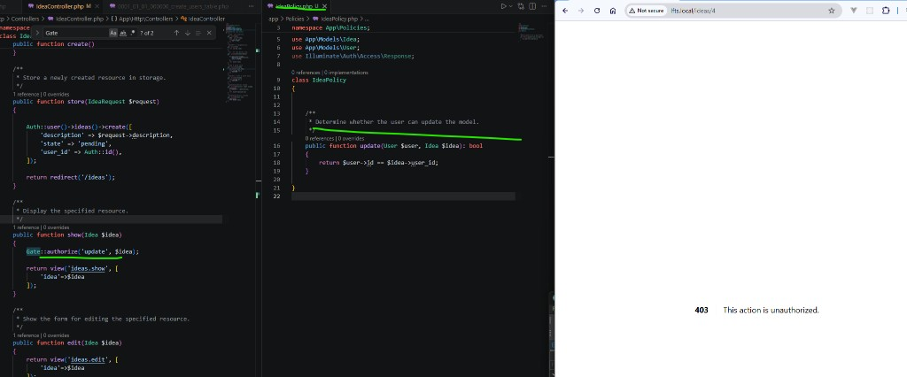

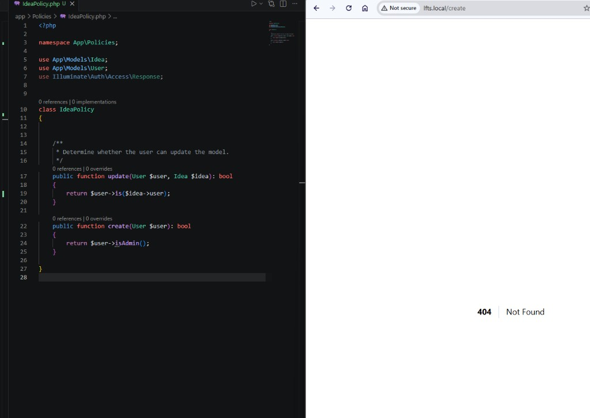

### Problemas y soluciones

No se reportaron errores. La policy bloquea correctamente acceso a ideas de otros usuarios.

### Comentarios personales

Policies escalan mejor que Gates cuando la autorización depende del **recurso** (modelo + usuario). El Ep. 19 pasa a Vite para assets frontend.

### Commit Git

```
episodio-18: IdeaPolicy ownership y create solo admin
```

---

## Episodio 19: Frontend Asset Bundling with Vite {#episodio-19}

### Resumen

Se migró el frontend del **CDN** (Tailwind browser + DaisyUI por `<link>`) al **empaquetado local con Vite**. Tailwind CSS 4, DaisyUI 5 y la fuente Instrument Sans se compilan en `resources/css/app.css` y se cargan en el layout con la directiva `@vite`.

El acceso a la app sigue siendo por **Apache** (`http://lfts.local`), no por `php artisan serve` ni por el dev server de Vite. El flujo de desarrollo usa `npm run build` / `npm run watch` y **refresh manual** en el navegador (F5).

### Dependencias — `package.json`

```json
"devDependencies": {
    "@tailwindcss/vite": "^4.0.0",
    "daisyui": "^5.6.3",
    "laravel-vite-plugin": "^3.1",
    "tailwindcss": "^4.0.0",
    "vite": "^8.0.0"
}
```

Scripts npm:

| Comando | Uso |
|---------|-----|
| `npm run build` | Compila assets a `public/build/` (producción o primera vez) |
| `npm run watch` | Recompila al guardar cambios en CSS/JS (desarrollo con Apache) |
| `npm run dev` | Dev server de Vite (no requerido con Apache) |

### CSS — `resources/css/app.css`

```css
@import 'tailwindcss';

@source '../../vendor/laravel/framework/src/Illuminate/Pagination/resources/views/*.blade.php';
@source '../../storage/framework/views/*.php';
@source '../**/*.blade.php';
@source '../**/*.js';

@plugin "daisyui" {
    themes: black --default;
}

@theme {
    --font-sans: 'Instrument Sans', ui-sans-serif, system-ui, sans-serif, ...;
}
```

- `@import 'tailwindcss'` — Tailwind CSS 4 vía Vite.
- `@source` — indica a Tailwind qué archivos escanear para clases (Blade, JS).
- `@plugin "daisyui"` — integra DaisyUI; tema `black` como predeterminado.
- `@theme` — fuente personalizada (Instrument Sans vía `laravel-vite-plugin/fonts`).

**Temas personalizados:** DaisyUI 5 permite definir temas propios con `@plugin "daisyui/theme" { name: "mitema"; --color-primary: ...; }` en el mismo archivo CSS.

### Layout — `resources/views/components/layout.blade.php`

**Antes (Ep. 13 — CDN):**

```html
<script src="https://cdn.jsdelivr.net/npm/@tailwindcss/browser@4"></script>
<link href="https://cdn.jsdelivr.net/npm/daisyui@5" rel="stylesheet" />
<link href="https://cdn.jsdelivr.net/npm/daisyui@5/themes.css" rel="stylesheet" />
<style>/* CSS manual .card, .max-w-400 */</style>
```

**Después (Ep. 19 — Vite):**

```blade
<html lang="en" data-theme="black">
<head>
    <title>{{ $title }}</title>
    @vite(['resources/css/app.css', 'resources/js/app.js'])
</head>
<body>
    <x-nav />
    <main class="max-w-3xl mx-auto mt-6">{{ $slot }}</main>
</body>
```

Se eliminaron los CDN, el `<style>` manual que pisaba las clases `.card` de DaisyUI, y se mantuvo `data-theme="black"`.

### Vite — `vite.config.js`

```js
import { defineConfig } from 'vite';
import laravel from 'laravel-vite-plugin';
import { bunny } from 'laravel-vite-plugin/fonts';
import tailwindcss from '@tailwindcss/vite';

export default defineConfig({
    plugins: [
        laravel({
            input: ['resources/css/app.css', 'resources/js/app.js'],
            refresh: [
                'resources/views/**',
                'routes/**',
                'app/View/Components/**',
            ],
            fonts: [
                bunny('Instrument Sans', { weights: [400, 500, 600] }),
            ],
        }),
        tailwindcss(),
    ],
});
```

`refresh` vigila vistas y rutas (útil si se usa `npm run dev`). Con Apache se prioriza `npm run watch` + F5.

### Flujo de trabajo con Apache

```bash
cd ~/sites/laravel-from-scratch-2026

npm install          # primera vez
npm run build        # compilar assets
npm run watch        # terminal abierta mientras desarrollas
```

1. Apache sirve la app en `http://lfts.local`.
2. `@vite` lee el manifiesto en `public/build/manifest.json`.
3. Tras cambiar CSS/Blade, `watch` recompila; refrescas el navegador manualmente.
4. Si existe `public/hot` (de un `npm run dev` anterior), eliminarlo para forzar el uso del build.

### Comparación Ep. 13 → Ep. 19

| Aspecto | Ep. 13 (CDN) | Ep. 19 (Vite) |
|---------|--------------|---------------|
| Tailwind | CDN `@tailwindcss/browser` | `@import 'tailwindcss'` + Vite |
| DaisyUI | CDN `<link>` | `@plugin "daisyui"` en CSS |
| Carga en layout | `<script>` + `<link>` | `@vite([...])` |
| Tema | `data-theme="black"` | Igual + `themes: black --default` |
| Desarrollo | Sin build | `npm run watch` + F5 |

### Comandos utilizados

```bash
npm install
npm run build
npm run watch
```

### Archivos modificados o creados

- `package.json` — dependencia `daisyui`, script `watch`
- `package-lock.json`
- `vite.config.js` — Tailwind, DaisyUI, refresh, fuente Instrument Sans
- `resources/css/app.css` — Tailwind 4 + DaisyUI + `@theme`
- `resources/js/app.js` — entry point de Vite
- `resources/views/components/layout.blade.php` — `@vite`, sin CDN
- `.env.example` — `APP_URL=http://lfts.local`
- `docs/entregable02.md` — documentación del episodio
- `docs/img/ep19-vite.png` — evidencia

### Evidencia

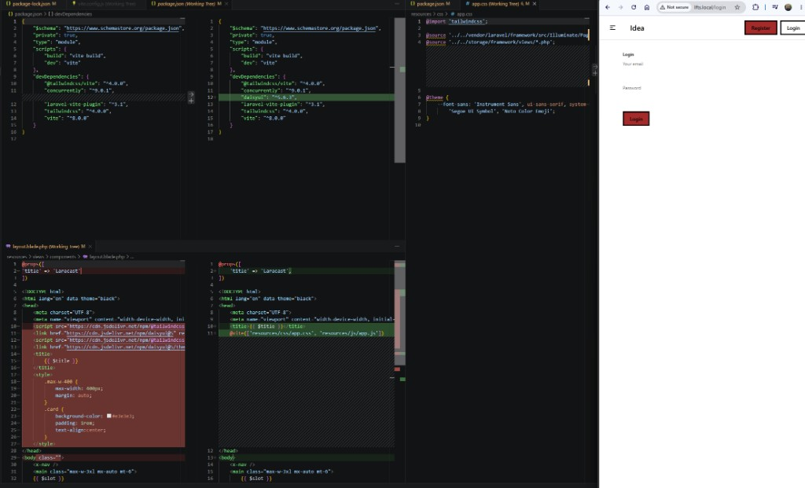

### Problemas y soluciones

| Problema | Causa | Solución |
|----------|-------|----------|
| Estilos DaisyUI no cargan | CDN removido pero sin `npm run build` | Ejecutar `npm run build` o `npm run watch` |
| Sigue buscando dev server | Archivo `public/hot` presente | Borrar `public/hot`; no usar `VITE_DEV_SERVER_URL` con Apache |
| `.card` sin estilo DaisyUI | `<style>` manual en layout pisaba componentes | Eliminar bloque `<style>` del layout |
| Error JSON recursion al editar | `request('idea')` tomaba el modelo de la ruta `{idea}` | Usar `request('description')` en el PATCH (corregido en Ep. 9–10) |

### Comentarios personales

Vite centraliza Tailwind y DaisyUI en un solo pipeline. Con **Apache en Vagrant** no hace falta `npm run dev`: `npm run watch` recompila y el refresh en el navegador es suficiente. Los temas DaisyUI se configuran en CSS (`@plugin "daisyui/theme"`), lo que facilita personalizar colores sin tocar cada vista Blade.

### Commit Git

```
episodio-19: empaquetado de assets con Vite
```

---

## Episodio 20: Notifications {#episodio-20}

### Resumen

Sistema de **notificaciones** completo: tabla `notifications`, `Notifiable` en `User`, clase **`IdeaPublished`** (canal `mail`), **Mailpit** en desarrollo y envío automático al **publicar una idea** desde `IdeaController::store()`.

### Tabla de notificaciones

```bash
php artisan make:notifications-table
php artisan migrate
```

Crea la migración `create_notifications_table` y la tabla en BD para notificaciones **database** (opcional) además del canal mail.

### Colección `$user->notifications` — Tinker

El modelo `User` usa `Notifiable`. En Tinker:

```bash
php artisan tinker
>>> App\Models\User::first()->notifications;
```

Retorna `DatabaseNotificationCollection` — vacía (`all: []`) hasta que se registren notificaciones en canal `database`. Confirma que la relación existe.

### Clase `IdeaPublished`

```bash
php artisan make:notification IdeaPublished
```

Canal **`mail`** vía `via()` → `toMail()` con `MailMessage` (greeting, líneas, action *Read It*).

### Enviar notificación — Tinker

```php
$john = App\Models\User::first();
$john->notify(new App\Notifications\IdeaPublished(App\Models\Idea::latest()->first()));
```

### Mail en desarrollo — `.env` + Mailpit

```env
MAIL_MAILER=smtp
MAIL_HOST=127.0.0.1
MAIL_PORT=1025
MAIL_FROM_ADDRESS="admin@lfts.local"
MAIL_FROM_NAME="${APP_NAME}"
```

Mailpit escucha SMTP en **1025**; UI web en **`http://192.168.33.10:8025`**. El correo *Idea Published* llega al email del usuario con asunto y cuerpo de Laravel.

### Integración en la app — `IdeaController::store()`

Tras crear la idea, se notifica al usuario autenticado:

```php
$idea = Auth::user()->ideas()->create([
    'description' => $request->description,
    'state' => 'pending',
    'user_id' => Auth::id(),
]);

Auth::user()->notify(new IdeaPublished($idea));

return redirect('/ideas');
```

Flujo: formulario create → `store()` → idea en BD → correo en Mailpit.

| Componente | Rol |
|------------|-----|
| `IdeaPublished` | Define qué se envía |
| `$user->notify()` | Dispara la notificación (Tinker o controller) |
| Mailpit | Servidor de correo local — captura mail en dev |
| `store()` | Envío automático al publicar idea |

### Comandos utilizados

```bash
php artisan make:notifications-table
php artisan migrate
php artisan make:notification IdeaPublished
php artisan tinker
```

### Archivos tocados

Migración `create_notifications_table`, `User.php` (`Notifiable`), `IdeaPublished.php`, `IdeaController.php` (`store`), `.env` (mail)

### Evidencia

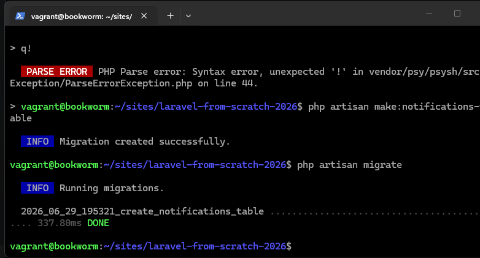

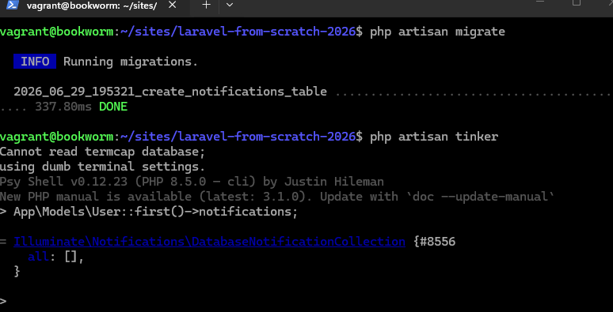

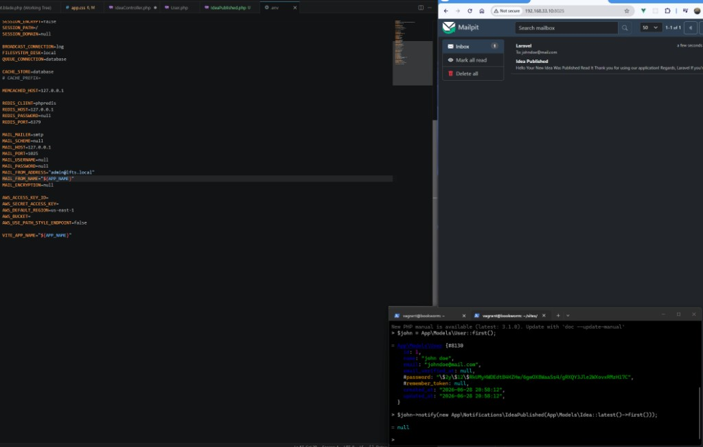

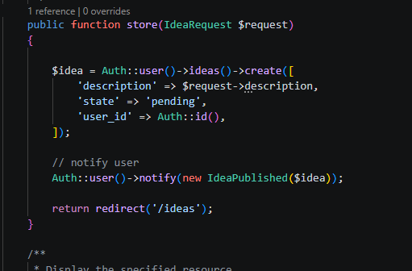

### Problemas y soluciones

En Tinker, salir con `exit` o Ctrl+D — no usar `q!` (provoca parse error en PsySH). Mailpit debe estar corriendo en la VM para ver correos en `:8025`.

### Comentarios personales

Episodio cerrado con flujo end-to-end: app + servidor de correos local. En el Ep. 21 se encolarán notificaciones con `ShouldQueue` y `queue:work`.

### Commit Git

```
episodio-20: notificaciones IdeaPublished y Mailpit
```

---

## Episodio 21: When to Queue it Up {#episodio-21}

### Resumen

Se introdujeron **colas (queues)** en Laravel: procesos que corren **fuera del request** del usuario. Se creó el job **`UpdateIdeaStatistics`**, se despachó con Tinker, se procesó con **`queue:work`** y se verificó en la tabla **`jobs`** de BD y en `storage/logs/laravel.log`.

### Conceptos — queue, job, worker

| Término | Qué es |
|---------|--------|
| **Queue** | Pila de trabajo — lista de tareas pendientes (en BD, Redis, etc.) |
| **Job** | La tarea concreta — clase con lógica en `handle()` |
| **Worker** | Proceso que saca jobs de la cola y los ejecuta (`php artisan queue:work`) |

**Cuándo usar colas:** envío de correos, estadísticas, reportes, APIs lentas — cualquier cosa que no deba bloquear la respuesta al usuario.

### Configuración

```env
QUEUE_CONNECTION=database
```

Tabla `jobs` (migración Laravel por defecto o `php artisan queue:table` + `migrate`).

### Crear un Job

```bash
php artisan make:job
# Name: UpdateIdeaStatistics
```

Genera `app/Jobs/UpdateIdeaStatistics.php`:

```php
class UpdateIdeaStatistics implements ShouldQueue
{
    use Queueable;

    public function handle(): void
    {
        logger('The job UpdateIdeaStatistics is being processed');
    }
}
```

`implements ShouldQueue` → el job va a la cola, no corre inline.

### Despachar un Job

**Tinker:**

```php
App\Jobs\UpdateIdeaStatistics::dispatch();
// => Illuminate\Foundation\Bus\PendingDispatch
```

También desde controladores: `UpdateIdeaStatistics::dispatch()` o `dispatch(new UpdateIdeaStatistics())`.

### Procesar la cola — worker

Terminal aparte (debe estar corriendo):

```bash
php artisan queue:work
```

Salida:

```text
INFO  Processing jobs from the [default] queue.
App\Jobs\UpdateIdeaStatistics ........ RUNNING
App\Jobs\UpdateIdeaStatistics ........ DONE
```

Log en `storage/logs/laravel.log`:

```text
local.DEBUG: The job UpdateIdeaStatistics is being processed
```

### Jobs en la base de datos

Tabla **`jobs`** en DBeaver (`larabase`): filas con `queue` = `default`, `payload` (JSON serializado), `attempts` = 0 hasta que el worker las procesa.

Sin `queue:work` activo, los jobs **se acumulan** en `jobs` y no se ejecutan.

### Relación con Ep. 20

`IdeaPublished` puede implementar `ShouldQueue` para encolar el correo en lugar de enviarlo en el mismo request — mismo patrón que `UpdateIdeaStatistics`.

### Comandos utilizados

```bash
php artisan make:job          # UpdateIdeaStatistics
php artisan queue:work
php artisan tinker            # dispatch()
```

### Archivos tocados

`app/Jobs/UpdateIdeaStatistics.php`, `.env` (`QUEUE_CONNECTION=database`), tabla `jobs`

### Evidencia

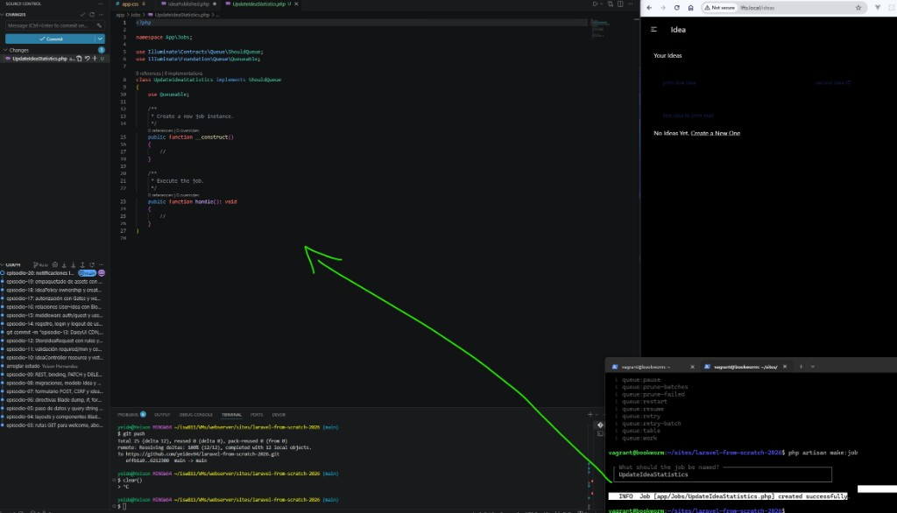

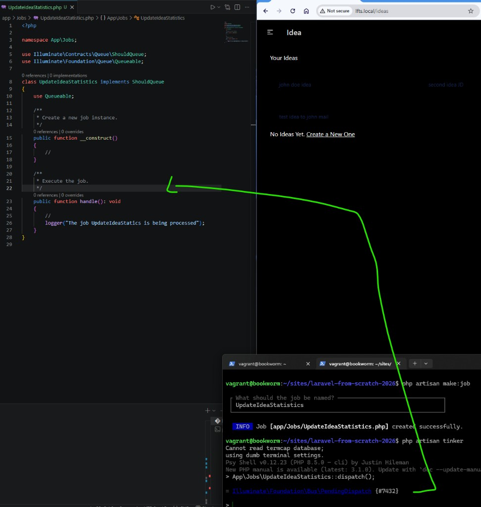

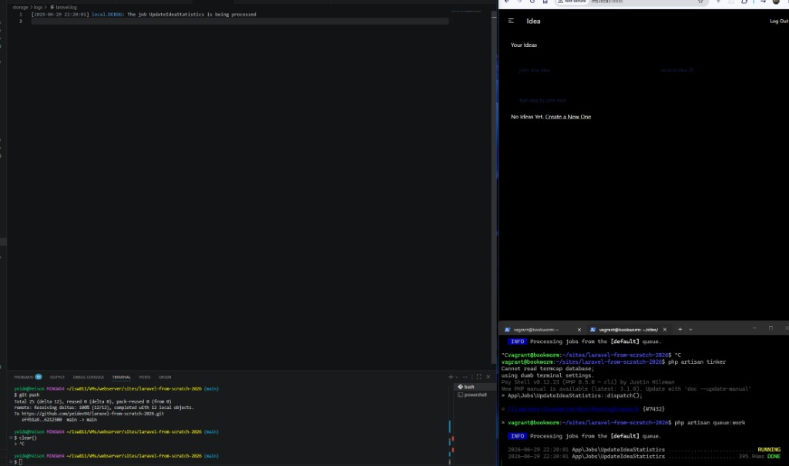

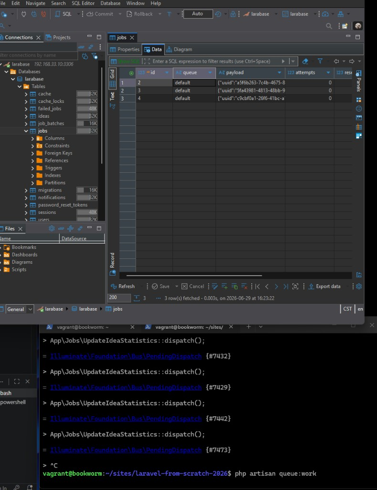

### Problemas y soluciones

Si el job no corre: verificar que `queue:work` esté activo y `QUEUE_CONNECTION=database`. Jobs pendientes visibles en tabla `jobs`.

### Comentarios personales

El worker es un proceso de larga duración — en producción se usa Supervisor o similar. Ep. 22 entra en testing con Pest.

### Commit Git

```
episodio-21: job UpdateIdeaStatistics y queue:work
```

---

## Episodio 22: How to Get Started Testing Your Code {#episodio-22}

### Resumen

Se introducen **pruebas automatizadas con Pest** en Laravel. Pest permite escribir tests legibles con sintaxis `it()` / `expect()` y cubre:

| Tipo | Carpeta típica | Qué prueba |
|------|----------------|------------|
| **Unit** | `tests/Unit/` | Una clase o función aislada |
| **Feature** | `tests/Feature/` | HTTP, rutas, controladores, integración |
| **Browser** | `tests/Feature/` *(con plugin)* | UI real con **Playwright** — navegador headless |

En este episodio se usa el plugin **`pest-plugin-browser`**: `visit()` abre una URL, `assertSee()` comprueba texto en pantalla, `fill()` / `press()` simulan formularios. Los browser tests viven en `tests/Feature/` pero ejecutan un navegador real (Chrome por defecto).

### Primer browser test — `ExampleTest.php`

```php
<?php

it('the application returns a successful response', function () {
    visit('/')->assertSee('Welcome');
});
```

Ejecutar:

```bash
php artisan test
# o
./vendor/bin/pest
```

En la VM el test pasó pero tardó **~16.66 s** para una sola aserción — el entorno Vagrant + Playwright es lento comparado con tests PHP puros.

### Depuración con `->debug()`

En cualquier punto de la cadena del browser test se puede llamar `->debug()`:

```php
visit('/register')
    ->fill('email', 'test@mail.com')
    ->debug()   // pausa, abre navegador en modo headed y muestra la página
    ->press('@register-button');
```

También existe configuración global `pest()->browser()->debug()` en `tests/Pest.php` para depurar aserciones.

### Test de registro — `AuthTest.php`

```php
<?php

use App\Models\User;

it('register a user', function () {
    visit('/register')
        ->fill('name', 'Jane Doe')
        ->fill('email', 'janedoe@mail.com')
        ->fill('password', 'secret1234')
        ->press('@register-button')
        ->assertPathIs('/ideas');
});
```

El botón usa `data-test="register-button"` → selector `@register-button` en Pest.

Tras el registro, `RegisteredUserController::store()` hace `Auth::login()` y `redirect('/ideas')`.

### Timeout del navegador (problema principal)

**Error observado:**

```text
Timeout 5000ms exceeded.
A screenshot of the page has been saved to [Tests/Browser/Screenshots/it_register_a_user].
```

**Diagnóstico:** el usuario **sí se crea en la BD** (`larabase.users`), así que el POST `/register` funciona. El fallo ocurre **después**, cuando Pest espera que la URL sea `/ideas` (`assertPathIs`). El timeout por defecto de Playwright es **5000 ms** — insuficiente en la VM (el `ExampleTest` simple ya tarda ~17 s).

**Solución — aumentar timeout global** en `tests/Pest.php`:

```php
pest()->browser()->timeout(60_000); // 60 segundos para toda la suite browser
```

Colocar **antes** del bloque `pest()->extend(...)`.

Alternativa por test (sin cambiar global):

```php
use Pest\Browser\Playwright\Playwright;

Playwright::usingTimeout(60_000, function () {
    visit('/register')
        // ...
        ->assertPathIs('/ideas');
});
```

### Email duplicado en re-ejecuciones

`phpunit.xml` usa la BD real `larabase` y `RefreshDatabase` está comentado en `Pest.php`. Si el test ya corrió una vez, `janedoe@mail.com` existe → validación `unique:users` falla → la página **no** redirige a `/ideas` y `assertPathIs` agota el timeout.

Opciones:

1. Borrar el usuario de prueba en DBeaver antes de re-correr.
2. Email único por ejecución: `'jane' . uniqid() . '@mail.com'`.
3. Descomentar `->use(RefreshDatabase::class)` en `Pest.php` *(migra/limpia BD en cada test — usar con cuidado en `larabase` compartida)*.

### Aserciones alternativas

Si el path tarda pero la página ya cargó:

```php
->assertSee('Your Ideas')   // texto del index de ideas
// o
->assertPathIs('/ideas')    // preferido cuando el redirect ya ocurrió
```

Revisar el screenshot en `tests/Browser/Screenshots/it_register_a_user` para ver en qué URL quedó el navegador al fallar.

### Comandos utilizados

```bash
php artisan test
./vendor/bin/pest
./vendor/bin/pest --filter="register a user"
./vendor/bin/pest tests/Feature/AuthTest.php
```

### Archivos modificados o creados

- `tests/Pest.php` — `pest()->extend(TestCase::class)`, timeout browser
- `tests/Feature/ExampleTest.php` — `visit('/')` + `assertSee('Welcome')`
- `tests/Feature/AuthTest.php` — registro vía browser
- `resources/views/auth/register.blade.php` — `data-test="register-button"`
- `tests/Browser/Screenshots/` — capturas automáticas al fallar

### Evidencia

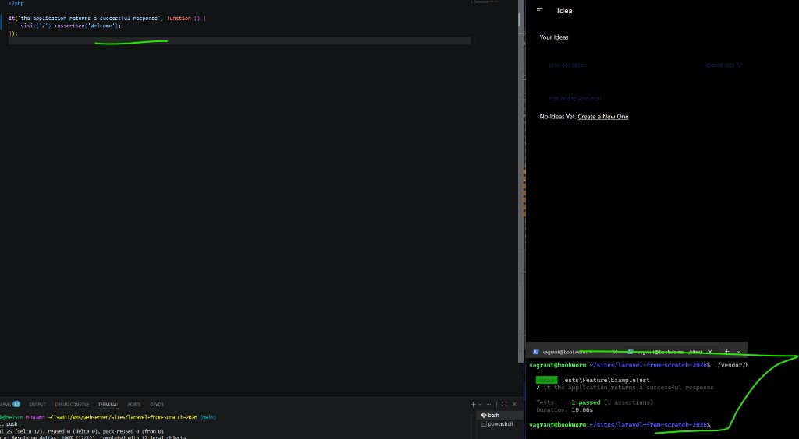

*(Pendiente captura: AuthTest PASS — no completado por tiempos de ejecución en VM.)*

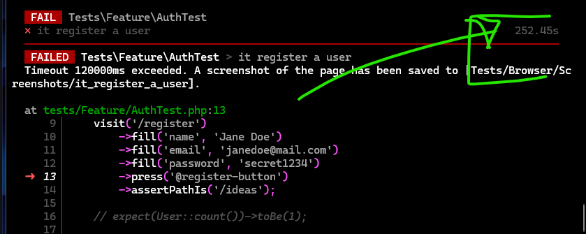

### Estado del episodio: **inconcluso**

Se dejó el capítulo sin cerrar por **tiempos de ejecución inaceptables** en la VM con browser tests (Playwright):

| Test | Resultado | Duración |
|------|-----------|----------|
| `ExampleTest` — `assertSee('Welcome')` | PASS | ~16.66 s |
| `AuthTest` — registro completo | FAIL | **~252.45 s** |

Tras subir el timeout a `120_000` ms (`pest()->browser()->timeout(120_000)`), el fallo pasó a:

```text
Timeout 120000ms exceeded.
FAIL at tests/Feature/AuthTest.php:13 → ->press('@register-button')
```

El usuario **sí se crea en BD**, pero el navegador en Vagrant no completa el flujo dentro del límite. Para el entregable se documenta lo aprendido (Pest, browser plugin, `debug()`, timeouts); los browser tests del Ep. 22 y Ep. 26 se retoman solo si el entorno mejora o se usa máquina más rápida / `sqlite :memory:`.

### Problemas y soluciones

| Problema | Causa | Solución |
|----------|-------|----------|
| `Timeout 5000ms exceeded` | VM lenta; default Playwright = 5 s | `pest()->browser()->timeout(120_000)` en `Pest.php` |
| `Timeout 120000ms exceeded` (~252 s total) | VM + Playwright demasiado lentos para browser tests | Ep. 22 dejado inconcluso; continuar con proyecto final |
| Usuario en BD pero test falla | Registro OK; timeout en `press` o `assertPathIs` | Revisar screenshot en `tests/Browser/Screenshots/` |
| Falla en segunda ejecución | Email duplicado | Email único o limpiar BD |
| No encuentra botón | Falta `data-test` | `@register-button` en el `<button>` |

### Comentarios personales

Los browser tests validan el flujo completo pero en Vagrant son impracticables (~252 s y aún fallan). Se prioriza avanzar al **proyecto final Idea** (Ep. 23+). Feature/unit tests PHP puros siguen siendo viables en esta VM.

### Commit Git

```
episodio-22: Pest browser tests (inconcluso — timeout VM)
```

---

## Episodio 23: Final Project Setup {#episodio-23}

### Resumen

Se inició el **proyecto final Idea** siguiendo el workflow de Jeffrey Way: Laravel nuevo, herramientas de calidad y preparación para los episodios 24–43.

**Lo implementado en la VM:**

1. Proyecto Laravel **nuevo** en `~/sites/laravel-from-scratch-2026` (Pest, sin browser plugin del curso anterior).
2. Proyecto de práctica (eps. 1–22) **conservado** en `~/sites/laravel-from-scratch-2026-old`.
3. **Rector** + **driftingly/rector-laravel** instalados y configurados en `rector.php`.
4. Script **`composer run format`** (Rector → Pint).
5. Herramientas **third-party** del episodio revisadas *(gratis vs pagas — ver tabla abajo)*.

En este episodio **no hay lógica de la app Idea** todavía; eso empieza en el Ep. 24.

### Reorganización de carpetas (ISW811)

| Carpeta | Contenido |
|---------|-----------|
| `laravel-from-scratch-2026` | Proyecto Idea **activo** + `docs/` + `rector.php` |
| `laravel-from-scratch-2026-old` | CRUD, auth, gates, colas, tests browser (Ep. 1–22) |

La documentación de **todos** los episodios sigue en `laravel-from-scratch-2026/docs/`.

### Herramientas del episodio — gratis vs pagas

| Herramienta | Tipo | Uso en Ep. 23 | Estado |
|-------------|------|---------------|--------|
| **Git / GitHub** | Gratis | Repo y commits por episodio | Según flujo del curso |
| **Laravel Pint** | Gratis (incluido en Laravel) | Formateo PHP | ✅ Incluido |
| **Rector** | Gratis | Modernizar PHP, `strict_types` | ✅ Instalado |
| **rector-laravel** | Gratis | Reglas Laravel en Rector | ✅ Instalado |
| **Extensión Laravel** (Cursor/VS Code) | Gratis | Blade, Artisan, rutas | Recomendada |
| **Laravel Boost** | Gratis | MCP / contexto IA para Laravel | Opcional Ep. 23 |
| **Code Rabbit** | Freemium / pago | Revisión de código pre-commit | Opcional |
| **Laravel Forge** | Pago | Deploy a producción | Opcional (referencia video) |

### Instalación Rector

```bash
cd ~/sites/laravel-from-scratch-2026
composer require rector/rector --dev
composer require driftingly/rector-laravel --dev
vendor/bin/rector init
```

### Configuración — `rector.php`

Archivo en la raíz del proyecto activo. Puntos clave:

- **`withPaths`:** `app`, `bootstrap`, `config`, `public`, `resources`, `routes`, `tests`
- **`withSkip`:** `bootstrap/cache`, `storage`, `vendor`; reglas excluidas en `resources/views`
- **`LaravelSetProvider`** + **`withComposerBased(laravel: true)`**
- **`withPreparedSets`:** `deadCode`, `codeQuality`, `typeDeclarations`, `privatization`, `earlyReturn`
- **Regla explícita:** `DeclareStrictTypesRector` → añade `declare(strict_types=1);`

```bash
vendor/bin/rector process --dry-run
vendor/bin/rector process
```

**Resultado observado:** `[OK] 19 files have been changed by Rector` — principalmente `declare(strict_types=1)` en archivos de `config/` y similares (regla `SafeDeclareStrictTypesRector`).

### Script Composer `format`

En `composer.json`:

```json
"format": [
    "vendor/bin/rector",
    "vendor/bin/pint"
]
```

```bash
composer run format
```

Ejecuta primero Rector (refactor) y luego Pint (estilo).

### La app Idea — qué viene después

| Funcionalidad | Episodio aprox. |
|---------------|-----------------|
| Modelos `Idea`, `Step`, `IdeaStatus` | 24 |
| UI Tailwind, registro/login | 25 |
| Browser tests registro | 26 |
| Flash messages + Alpine | 27 |
| Tarjetas, filtros, show | 28–30 |

### Comandos utilizados

```bash
# Nuevo proyecto (misma carpeta activa; anterior movido a -old)
cd ~/sites
laravel new laravel-from-scratch-2026   # o mover -old y crear fresh

cd ~/sites/laravel-from-scratch-2026
composer require rector/rector --dev
composer require driftingly/rector-laravel --dev
vendor/bin/rector init
vendor/bin/rector process
composer run format
```

### Archivos modificados o creados

| Archivo / carpeta | Descripción |
|-------------------|-------------|
| `~/sites/laravel-from-scratch-2026/` | Proyecto Laravel nuevo (Idea) |
| `~/sites/laravel-from-scratch-2026-old/` | Archivo Ep. 1–22 |
| `rector.php` | Config Rector + Laravel sets |
| `composer.json` | `rector`, `driftingly/rector-laravel`, script `format` |
| ~19 archivos PHP | `declare(strict_types=1)` vía Rector |

### Evidencia

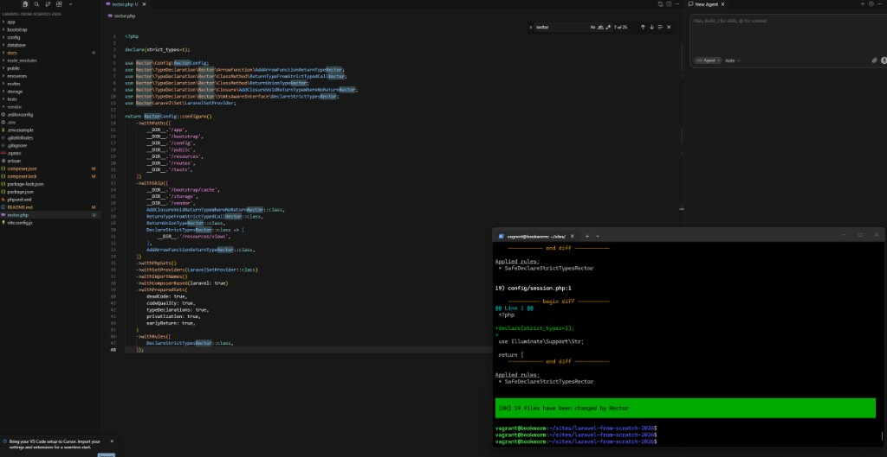

| Captura | Archivo | Estado |
|---------|---------|--------|
| Rector config + `process` | `ep23-rector.png` | ✅ |
| Proyecto nuevo / landing | `ep23-proyecto-nuevo.png` | Pendiente |
| GitHub | `ep23-github-repo.png` | Pendiente |
| `composer run format` | `ep23-pint-format.png` | Pendiente |
| Laravel Boost *(si aplica)* | `ep23-boost.png` | Opcional |

### Problemas y soluciones

| Problema | Solución |
|----------|----------|
| Confusión de carpetas | `-old` = práctica; activo = Idea + docs |
| Rector toca muchos archivos | Normal al inicio; usar `--dry-run` primero |
| Apache sigue apuntando al `-old` | Actualizar `DocumentRoot` en `lfts.local.conf` |

### Comentarios personales

Se conservó el trabajo de 22 episodios en `-old` sin mezclarlo con el Laravel fresco. Rector dejó el código listo con `strict_types` antes de modelar Idea en Ep. 24. Forge y Code Rabbit son opcionales para ISW811; Pint + Rector + Git cubren lo esencial del workflow.

### Commit Git

Desde la VM, en el repo activo (`laravel-from-scratch-2026`):

```bash
cd ~/sites/laravel-from-scratch-2026

git status
git add .
git commit -m "episodio-23: setup proyecto Idea, Rector y composer run format"
git push
```

Mensaje (misma convención que eps. 17–21):

```
episodio-23: setup proyecto Idea, Rector y composer run format
```

**Qué incluye este commit:** Laravel nuevo (proyecto Idea), `rector.php`, deps `rector` / `rector-laravel`, script `format` en `composer.json`, cambios de Rector en ~19 archivos, documentación Ep. 23 en `docs/` y `docs/img/ep23-rector.png`.

**Nota:** `laravel-from-scratch-2026-old` vive como carpeta hermana en `~/sites/` (archivo Ep. 1–22). No va dentro del repo del proyecto nuevo salvo que decidas versionarlo aparte o incluirlo solo en el `.tar.gz` del entregable.

### Checklist — Ep. 23

- [x] Proyecto Laravel nuevo (Idea) en carpeta activa
- [x] Proyecto anterior en `laravel-from-scratch-2026-old`
- [x] Rector + `rector.php` + `rector process` (19 files)
- [x] Script `composer run format`
- [ ] GitHub push *(si aplica)*
- [ ] Laravel Boost / Code Rabbit / Forge *(opcionales)*

---

## Episodio 24: Design Your Model Layer {#episodio-24}

### Resumen

Se definió la **capa de modelos** del proyecto Idea antes de la UI: **`Idea`**, **`Step`**, enum **`IdeaStatus`**, migraciones, factories, configuración Eloquent estricta y **tests Pest** que comprueban relaciones `User` ↔ `Idea` ↔ `Step`.

### Relaciones Eloquent

```
User 1 ──hasMany──> Idea *
Idea   ──belongsTo──> User
Idea 1 ──hasMany──> Step *
Step   ──belongsTo──> Idea
```

| Modelo | Método | Tipo |
|--------|--------|------|
| `User` | `ideas()` | `hasMany(Idea::class)` |
| `Idea` | `user()` | `belongsTo(User::class)` |
| `Idea` | `steps()` | `hasMany(Step::class)` |
| `Step` | `idea()` | `belongsTo(Idea::class)` |

### Migración `ideas`

Archivo: `database/migrations/2026_06_30_043337_create_ideas_table.php`

| Columna | Tipo |
|---------|------|
| `title` | string |
| `description` | text, nullable |
| `user_id` | FK → `users`, cascade on delete |
| `links` | json, default `[]` |
| `status` | string, default `pending` |
| `image_path` | string, nullable |

### Migración `steps`

Archivo: `database/migrations/2026_06_30_044745_create_steps_table.php`

| Columna | Tipo |
|---------|------|
| `description` | text |
| `completed` | boolean, default `false` |
| `idea_id` | FK → `ideas`, cascade on delete |

### Enum `IdeaStatus` — `app/IdeaStatus.php`

```php
enum IdeaStatus: string
{
    case Pending = 'pending';
    case InProgress = 'in-progress';
    case Completed = 'completed';

    public function label(): string { /* match → Pending, In Progress, Completed */ }
}
```

### Modelo `Idea` — casts y defaults

```php
protected $casts = [
    'links' => AsArrayObject::class,
    'status' => IdeaStatus::class,
];

protected $attributes = [
    'status' => IdeaStatus::Pending,
];
```

En **Tinker**, `Idea::factory()->make()->status` devuelve el enum `Pending` aunque la factory no lo setee explícitamente — gracias a `$attributes`.

### Modelo `Step` — default `completed`

```php
protected $attributes = [
    'completed' => false,
];
```

### Config Eloquent — `AppServiceProvider`

```php
Model::unguard();
Model::shouldBeStrict();
Model::automaticallyEagerLoadRelationships();
```

### Factories

- **`IdeaFactory`:** `title`, `description`, `links`, `image_path`, `user_id` → `User::factory()`
- **`StepFactory`:** `description`, `completed` → false, `idea_id` → `Idea::factory()`

### Tests — `tests/Feature/IdeaTest.php`

```php
test('it belongs to a user', function () {
    $idea = Idea::factory()->create();
    expect($idea->user)->toBeInstanceOf(User::class);
});

test('it can have steps', function () {
    $idea = Idea::factory()->create();
    expect($idea->steps)->toBeInstanceOf(Collection::class);

    $idea->steps()->create(['description' => 'Do the thing']);

    expect($idea->fresh()->steps)->toHaveCount(1);
});
```

Ejecución:

```bash
vendor/bin/pest tests/Feature/IdeaTest.php
# Tests: 2 passed — ~11.54 s (primer test documentado en evidencia)
```

También se generaron con `make:model Idea -mfppc`: `IdeaPolicy`, `IdeaController` *(para episodios posteriores)*.

### Comandos utilizados

```bash
cd ~/sites/laravel-from-scratch-2026
php artisan make:model Idea -mfppc
php artisan make:enum IdeaStatus
php artisan make:model Step -mf
php artisan migrate
php artisan make:test IdeaTest
vendor/bin/pest tests/Feature/IdeaTest.php
php artisan tinker    # Idea::factory()->make()->status
```

### Archivos tocados

| Archivo | Rol |
|---------|-----|
| `app/Models/Idea.php` | Casts, relaciones, default status |
| `app/Models/Step.php` | `idea()`, default completed |
| `app/Models/User.php` | `ideas()` |
| `app/IdeaStatus.php` | Enum backed + `label()` |
| `database/migrations/*_create_ideas_table.php` | Tabla ideas |
| `database/migrations/*_create_steps_table.php` | Tabla steps |
| `database/factories/IdeaFactory.php` | Dummy ideas |
| `database/factories/StepFactory.php` | Dummy steps |
| `app/Providers/AppServiceProvider.php` | unguard, strict, eager load |
| `tests/Feature/IdeaTest.php` | 2 tests de relaciones |
| `app/Policies/IdeaPolicy.php` | Generado (Ep. futuro) |
| `app/Http/Controllers/IdeaController.php` | Generado (Ep. futuro) |

### Evidencia

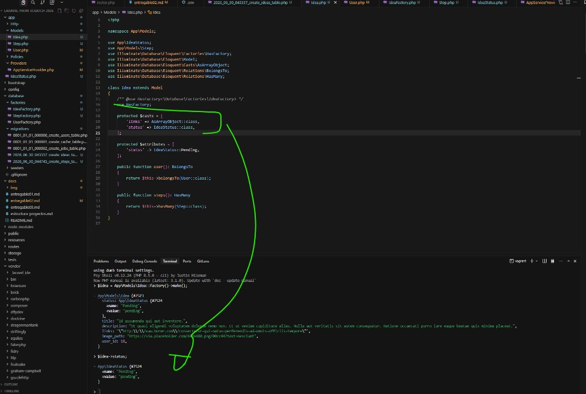

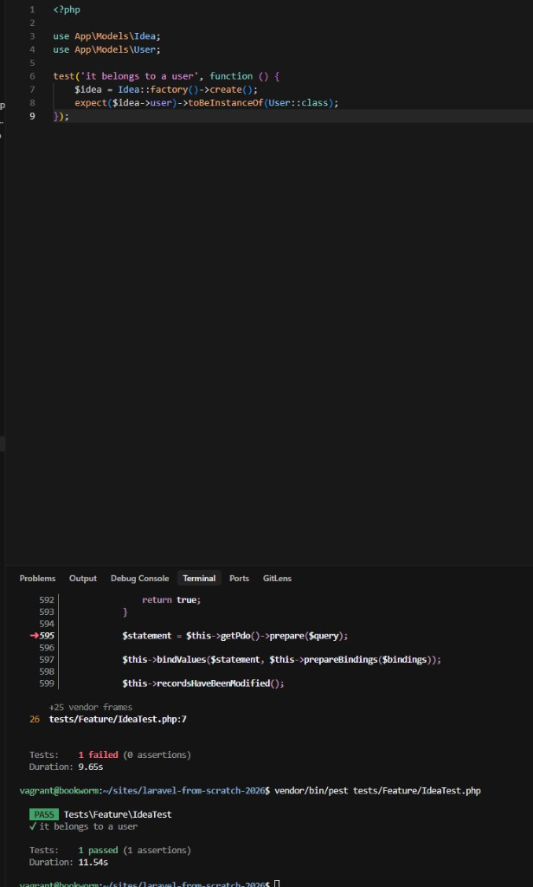

### Problemas y soluciones

Primer intento del test falló por error de BD al preparar el statement (stack trace en `vendor/`); tras migraciones y factories correctas, **`vendor/bin/pest tests/Feature/IdeaTest.php`** pasó en verde.

### Comentarios personales

Capa de dominio lista sin tocar UI. El enum + `$attributes` evitan strings mágicos para `status`. Ep. 25 entra en Tailwind, layout y registro/login.

### Commit Git

```bash
cd ~/sites/laravel-from-scratch-2026
git add .
git commit -m "episodio-24: modelos Idea y Step, IdeaStatus y tests"
git push
```

```
episodio-24: modelos Idea y Step, IdeaStatus y tests
```

### Checklist — Ep. 24

- [x] Modelos `Idea`, `Step`, `User`
- [x] Enum `IdeaStatus` + cast + Tinker
- [x] Migraciones `ideas` y `steps`
- [x] Relaciones hasMany / belongsTo
- [x] Factories + config Eloquent en `AppServiceProvider`
- [x] `IdeaTest` (2 tests) PASS
- [x] Evidencias `ep24-enum-tinker.png`, `ep24-idea-test-pass.png`

---

## Episodio 25: Tailwind Theme Setup And Initial UI {#episodio-25}

### Resumen

Se montó la **UI inicial** del proyecto Idea: tema Tailwind 4 personalizado, layout con nav, componentes de formulario reutilizables y las vistas de **registro** y **login** funcionando en `http://lfts.local`. El registro crea el usuario en BD y hace login automático.

### Tema Tailwind — `resources/css/app.css`

Tailwind 4 con `@theme` (variables de color en OKLCH) y fuente Instrument Sans:

```css
@import 'tailwindcss';
@import '../components/btn.css' layer(components);
@import '../components/form.css' layer(components);

@theme {
    --font-sans: 'Instrument Sans', ui-sans-serif, system-ui, sans-serif;
    --color-background: oklch(0.12 0 0);
    --color-foreground: oklch(0.95 0 0);
    --color-primary: oklch(0.65 0.15 160);
    --color-border: oklch(0.24 0 0);
    /* ... */
}
```

Colores expuestos como utilidades (`bg-background`, `text-foreground`, `border-border`, etc.) usados en el layout.

### Layout y nav

**`components/layout/layout.blade.php`** — `@props(['title' => 'Idea'])`, `@vite([...])`, `<x-layout.nav />` y `{{ $slot }}`.

**`components/layout/nav.blade.php`** — logo + enlaces condicionados con `@guest` / `@auth`:

```blade
@guest
    <a href="/login">Sign In In</a>
    <a href="/register" class="btn">Register</a>
@endguest

@auth
    <form action="/logout" method="POST">@csrf
        <button type="submit">Log Out</button>
    </form>
@endauth
```

### Componentes de formulario reutilizables

- **`components/form/form.blade.php`** — `@props(['title', 'description'])`, tarjeta centrada con título/descripción y `{{ $slot }}`.
- **`components/form/field.blade.php`** — `@props(['label', 'name', 'type' => 'text'])`, `<label>` + `<input>` con `old()` y bloque `@error`.

### Vistas de auth

**`auth/register.blade.php`:**

```blade
<x-layout title="Register">
    <x-form title="Register an account" description="Start tracking your ideas today.">
        <form method="POST" action="/register" class="space-y-6">
            @csrf
            <x-form.field name="name" label="What is your name?" />
            <x-form.field name="email" label="Email" type="email" />
            <x-form.field name="password" label="Password" type="password" />
            <button type="submit" class="btn mt-2 h-10">Create Account</button>
        </form>
    </x-form>
</x-layout>
```

**`auth/login.blade.php`** — misma estructura con campos email/password y botón "Sign In".

### Rutas y controlador

`routes/web.php` agrupa register/login bajo middleware `guest` y logout bajo `auth`:

```php
Route::middleware('guest')->group(function () {
    Route::get('/register', [RegisteredUserController::class, 'create']);
    Route::post('/register', [RegisteredUserController::class, 'store']);
    Route::get('/login', [SessionsController::class, 'create']);
    Route::post('/login', [SessionsController::class, 'store']);
});

Route::post('/logout', [SessionsController::class, 'destroy'])->middleware('auth');
```

`RegisteredUserController::store()` valida (`name`, `email` único, `password` con `Rules\Password::defaults()`), crea el usuario, hace `Auth::login()` y redirige a `/` con flash `success`.

### Comandos utilizados

```bash
cd ~/sites/laravel-from-scratch-2026
npm run dev     # Vite dev server (http://localhost:5173)
# o
npm run build   # assets compilados para Apache
```

### Archivos modificados o creados

| Archivo | Rol |
|---------|-----|
| `resources/css/app.css` | Tema Tailwind 4 + `@theme` |
| `resources/views/components/layout/layout.blade.php` | Layout base + `@vite` |
| `resources/views/components/layout/nav.blade.php` | Nav con `@guest`/`@auth` |
| `resources/views/components/form/form.blade.php` | Tarjeta de formulario |
| `resources/views/components/form/field.blade.php` | Campo input + error |
| `resources/views/auth/register.blade.php` | Vista registro |
| `resources/views/auth/login.blade.php` | Vista login |
| `routes/web.php` | Rutas guest/auth |
| `app/Http/Controllers/Auth/RegisteredUserController.php` | Registro + login |

### Evidencia

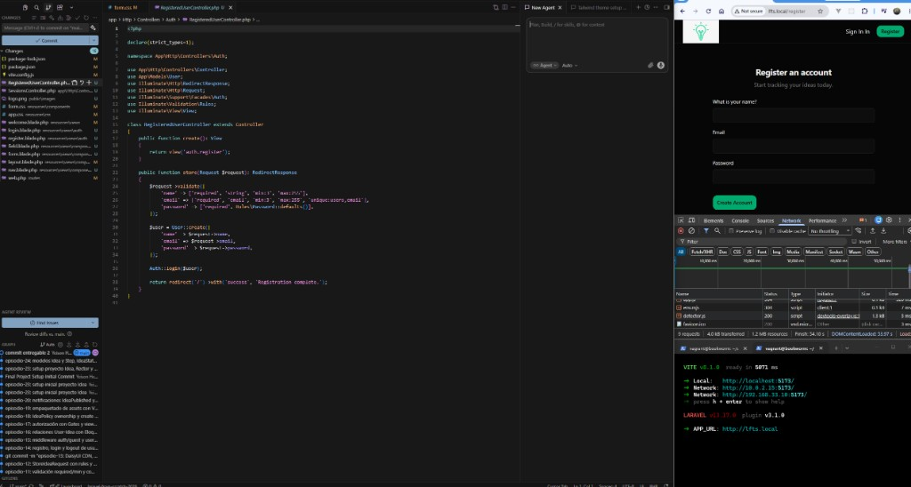

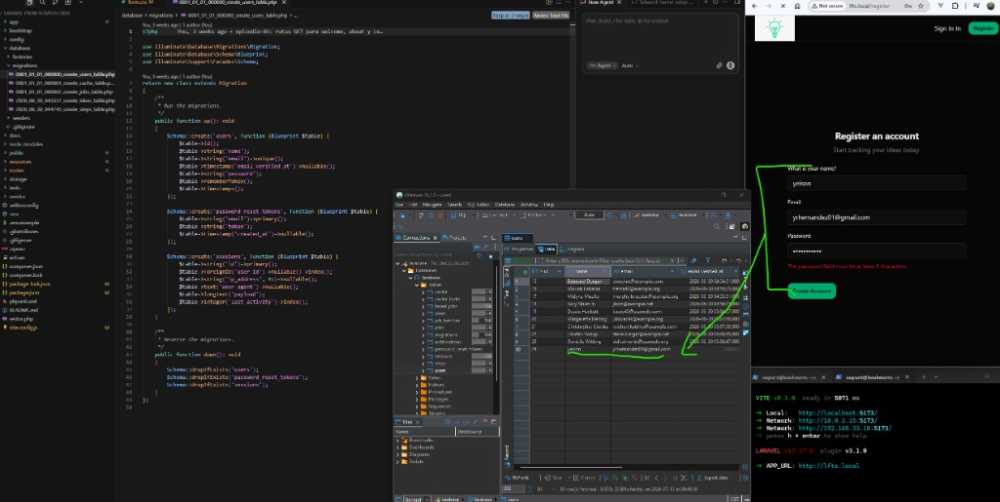

### Problemas y soluciones

**Vite lento en la VM.** Desde este episodio, con `npm run dev` corriendo (Vite en `:5173`), los cambios **cargan muy lento** al recargar en el navegador — el HMR/servidor de Vite dentro de Vagrant tiene latencia alta contra el host Windows. 

Mitigaciones:
- Usar **`npm run build`** y servir los assets ya compilados por Apache cuando la lentitud del dev server molesta (no hay recarga en vivo, pero carga rápido).
- Reservar `npm run dev` solo mientras se ajusta CSS activamente.
- Aceptar la latencia como limitación del entorno Vagrant (carpeta compartida), igual que en el Ep. 22 con los browser tests.

### Comentarios personales

Con el layout, los componentes `x-form` / `x-form.field` y el tema Tailwind, las próximas vistas (ideas, tarjetas) se arman rápido. El registro ya persiste en `users` y autentica. La lentitud de Vite en la VM es el principal fastidio del entorno.

### Commit Git

```bash
cd ~/sites/laravel-from-scratch-2026
git add .
git commit -m "episodio-25: tema Tailwind, layout y vistas de registro/login"
git push
```

```
episodio-25: tema Tailwind, layout y vistas de registro/login
```

### Checklist — Ep. 25

- [x] Tema Tailwind 4 en `app.css`
- [x] Layout + nav con `@guest`/`@auth`
- [x] Componentes `x-form` y `x-form.field`
- [x] Vistas register y login
- [x] Rutas guest/auth y `RegisteredUserController`
- [x] Registro persiste en BD (evidencia DBeaver)
- [x] Evidencias `ep25-register-form.png`, `ep25-register-dbeaver.png`

---

## Episodio 26: Browser Testing Registration Forms With Pest {#episodio-26}

### Resumen

Se escribieron **browser tests con Pest/Playwright** para los formularios de **registro**, **login** y **logout**, más un caso de **validación** (unhappy path). Los cuatro tests quedaron **creados** en `tests/Browser/RegisterTest.php`.

**Estado: inconcluso** — igual que el Ep. 22, los browser tests son **muy lentos desde la máquina anfitriona** (Vagrant + Playwright). Los tests están escritos y listos; su ejecución completa no es práctica en este entorno.

### Configuración — `tests/Pest.php`

Carpeta `Browser` con `RefreshDatabase` y timeout ampliado; `Feature` aparte:

```php
pest()->browser()->timeout(60_000);

pest()->extend(TestCase::class)
    ->use(RefreshDatabase::class)
    ->in('Browser');

pest()->extend(TestCase::class)
    ->in('Feature');
```

### Tests — `tests/Browser/RegisterTest.php`

Helpers de Pest Laravel importados:

```php
use function Pest\Laravel\assertAuthenticated;
use function Pest\Laravel\assertGuest;
```

**1. Registro (happy path):**

```php
it('registers a user', function () {
    visit('/register')
        ->fill('name', 'John Doe')
        ->fill('email', 'john@example.com')
        ->fill('password', 'password123')
        ->click('@register-button')
        ->assertPathIs('/');

    assertAuthenticated();

    $user = User::query()->findOrFail(Auth::id());

    expect($user->toArray())->toMatchArray([
        'name' => 'John Doe',
        'email' => 'john@example.com',
    ]);

    $this->assertDatabaseHas('users', ['email' => 'john@example.com']);
});
```

**2. Login (Arrange-Act-Assert):** crea el usuario primero porque `RefreshDatabase` deja la tabla vacía.

```php
it('logs in a user', function () {
    User::factory()->create([
        'email' => 'john@example.com',
        'password' => 'password123',
    ]);

    visit('/login')
        ->fill('email', 'john@example.com')
        ->fill('password', 'password123')
        ->click('@login-button')
        ->assertPathIs('/');

    assertAuthenticated();
});
```

**3. Logout:**

```php
it('logs out a user', function () {
    $user = User::factory()->create();
    $this->actingAs($user);

    visit('/')->click('Log Out');

    assertGuest();
});
```

**4. Validación (unhappy path):** sin email → sigue en `/register`.

```php
it('requires a valid email address', function () {
    visit('/register')
        ->fill('name', 'John')
        ->fill('password', 'password123')
        ->click('@register-button')
        ->assertPathIs('/register');
});
```

Los selectores `@register-button` / `@login-button` mapean a `data-test="..."` en los botones, para no confundirse con enlaces del nav.

### Comandos utilizados

```bash
composer require pestphp/pest-plugin-browser --dev
npx playwright install
vendor/bin/pest tests/Browser/RegisterTest.php
```

### Archivos modificados o creados

| Archivo | Rol |
|---------|-----|
| `tests/Browser/RegisterTest.php` | 4 tests: registro, login, logout, validación |
| `tests/Pest.php` | Carpeta `Browser` + `RefreshDatabase` + timeout 60 s |
| `resources/views/auth/register.blade.php` | `data-test="register-button"` |
| `resources/views/auth/login.blade.php` | `data-test="login-button"` |
| `composer.json` / `package.json` | `pest-plugin-browser` + Playwright |

### Evidencia

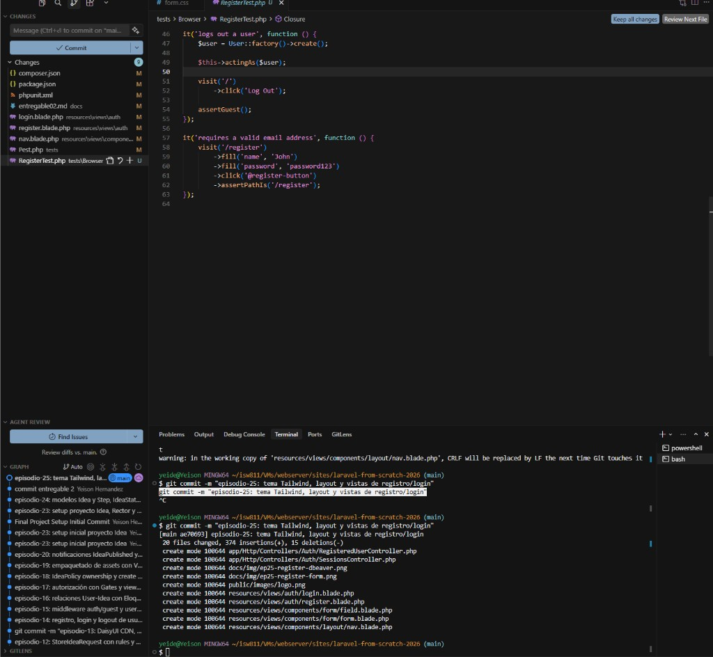

### Problemas y soluciones

**Browser tests muy lentos desde el anfitrión.** Igual que en el Ep. 22, ejecutar Playwright dentro de Vagrant desde Windows es impracticable por la latencia. Los tests quedan **escritos y versionados** como evidencia del aprendizaje; no se ejecuta la suite completa en este entorno.

| Problema | Solución / decisión |
|----------|----------------------|
| Lentitud de Playwright en VM | Dejar el episodio **inconcluso**; tests creados pero sin corrida completa |
| `login` con BD vacía | `User::factory()->create()` antes de `visit('/login')` |
| Click toma link del nav | `data-test` + selector `@...` |
| Timeout por defecto 5 s | `pest()->browser()->timeout(60_000)` en `Pest.php` |

### Comentarios personales

Los browser tests aportan cobertura del flujo real de auth, pero el entorno Vagrant no los hace viables (mismo problema del Ep. 22). Se priorizó dejar los tests listos y avanzar. En una máquina más rápida o con SQLite en memoria correrían sin problema.

### Commit Git

```bash
cd ~/sites/laravel-from-scratch-2026
git add .
git commit -m "episodio-26: browser tests de registro, login y logout (inconcluso — VM lenta)"
git push
```

```
episodio-26: browser tests de registro, login y logout (inconcluso — VM lenta)
```

### Checklist — Ep. 26

- [x] Plugin `pest-plugin-browser` instalado
- [x] Carpeta `Browser` + `Pest.php` con `RefreshDatabase` + timeout
- [x] `RegisterTest` (registro, login, logout, validación)
- [x] `data-test` en botones register/login
- [x] Evidencia `ep26-browser-tests.png`
- [ ] Ejecución completa de la suite *(no viable — VM lenta)*

---

## Episodios 27–30: Proyecto final (continuación)

Documentar cada episodio del 23 al 30 siguiendo la plantilla de arriba. Temas principales:

- **23:** Setup del repo, GitHub, herramientas (Pint, Rector, Boost) — [ver Ep. 23](#episodio-23)
- **24:** Modelos Idea, Step, IdeaStatus, factories y tests — [ver Ep. 24](#episodio-24)
- **25:** Tema Tailwind, componentes UI, registro/login — [ver Ep. 25](#episodio-25)
- **26:** Browser tests de registro — [ver Ep. 26](#episodio-26)
- **27:** Flash messages con Alpine.js
- **28:** Tarjetas de ideas y componentes x-card
- **29:** Filtrado por estado con scopes Eloquent
- **30:** Vista show de una idea individual

---

## Forma de entrega — `entregable02.tar.gz`

| Campo | Valor |
|-------|-------|
| **Archivo** | `entregable02.tar.gz` |
| **Ubicación al generar** | `~/sites/entregable02.tar.gz` (VM) o `...\VMs\webserver\sites\entregable02.tar.gz` (host) |
| **Contenido** | Carpeta `laravel-from-scratch-2026/` (código Ep. 23+, `docs/`, evidencias) |
| **Excluir** | `vendor/` y `node_modules/` |

### Comando (formato del profesor — VM)

```bash
cd ~/sites

tar cvfz entregable02.tar.gz \
  --exclude=laravel-from-scratch-2026/node_modules \
  --exclude=laravel-from-scratch-2026/vendor \
  laravel-from-scratch-2026/
```

Equivalente con llaves *(bash)*:

```bash
tar cvfz entregable02.tar.gz \
  --exclude={laravel-from-scratch-2026/node_modules,laravel-from-scratch-2026/vendor} \
  laravel-from-scratch-2026/
```

### Comando en Windows (host, PowerShell)

```powershell
cd C:\Users\yeide\isw811\VMs\webserver\sites

tar -cvzf entregable02.tar.gz `
  --exclude=./laravel-from-scratch-2026/node_modules `
  --exclude=./laravel-from-scratch-2026/vendor `
  ./laravel-from-scratch-2026
```

### Verificar antes de subir

```bash
# Listar contenido (primeras líneas)
tar -tzf entregable02.tar.gz | head

# Confirmar que NO hay vendor ni node_modules
tar -tzf entregable02.tar.gz | grep -E 'vendor|node_modules' || echo "OK — excluidos"

# Tamaño (~12 MB sin vendor; varía según docs/img)
ls -lh entregable02.tar.gz
```

**Generado:** ~11.5 MB (`12028615` bytes) — incluye `docs/`, `.git`, código Laravel; **sin** `vendor/` ni `node_modules/`.

El evaluador debe ejecutar `composer install` y `npm install` al descomprimir.

### Opcional — incluir archivo Ep. 1–22 (`-old`)

Si el docente pide también el CRUD de práctica (eps. 17–22 en `laravel-from-scratch-2026-old`):

```bash
cd ~/sites
tar cvfz entregable02-completo.tar.gz \
  --exclude=laravel-from-scratch-2026/node_modules \
  --exclude=laravel-from-scratch-2026/vendor \
  --exclude=laravel-from-scratch-2026-old/node_modules \
  --exclude=laravel-from-scratch-2026-old/vendor \
  laravel-from-scratch-2026/ laravel-from-scratch-2026-old/
```

> Usar **`entregable02.tar.gz`** (una carpeta) si el profesor no pidió lo contrario.

---

## Checklist de cierre — Entregable 02

- [ ] Episodios 17–30 completados y documentados
- [ ] `php artisan test` ejecutado con evidencia
- [ ] `php artisan queue:work` documentado cuando aplique
- [ ] `npm run dev` / `npm run build` documentados
- [ ] Archivo `entregable02.tar.gz` generado correctamente *(ver [Forma de entrega](#forma-de-entrega--entregable02targz))*
